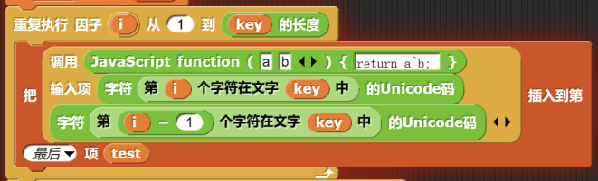
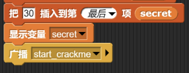

# 签到题

输错代码后，会看到官方提示：

> python3打印文件内容：
>
> ```python
> print(open('/etc/passwd').read())
> ```

可以猜测是需要通过输入代码打开什么文件，索性尝试`/flag`，输入`print(open('/flag').read())`结果如下：


获得`flag{Od2e2ea0-0896-4ee6-a925-09acee3db3a9}`

# 国粹

题干：


可以看到最后两张图长度相同，对齐后有一定的规律

+ 第一行相同牌面对应第二行的牌面没有重复的

+ 第一行相同的牌面，第二行对应的牌面按照一定的顺序排列：

  + 一万 到 九万
  
  + 一饼 到 九饼
  
  + 一条 到 九条
  
  + 东南西北风

  + 中发白

  + 春夏秋冬
  
  + 梅兰竹菊
  
    
  

同时题干图片中第一行第一个为空白第二行以一个为一万，可以联想到坐标轴，

于是尝试将`(a,k)`对应的各个点描出：


可以隐约发现`flag{}`，对图片进行翻转操作后：


最后获得`flag{202305012359}`（未验证）

# Modbus

题目为一个流量包，根据题干提示（还有高人指点），筛选`modbus`协议的流量包：


注意最后的`Word Count`，将前14个流量包对应的十六进制提取出来拼接获得

`MMYWMX3GNEYWOXZRGAYDA===`，再通过Base32解码获得`c1f_fi1g_1000`.

于是`flag{c1f_fi1g_1000}`（本题一直摸鱼，全靠队友:joy:）

# Babyre

打开附件`babyre.xml`可以看到`https://snap.berkeley.edu`访问将文件导入：

查看关键元素（lock）代码：


尝试运行（注意在设置中开启JavaScript拓展），发现需要输入一串字符，阅读关键部分代码。



可以看到键入输进去的字符按照Unicode编码相邻异或后得到`test`


对比了`test`和`secret`的字符是否相同。

所以先修改程序使其输出`secret`：



获得如下一串数字：

`102 10 13 6 28 74 3 1 3 7 85 0 4 75 20 92 92 8 28 25 81 83 7 28 76 88 9 0 29 73 0 86 4 87 87 82 84 85 4 85 87 30`

根据异或特性，编写逆向程序：

```python
l=[102,10,13,6,28,74,3,1,3,7,85,0,4,75,20,92,92,8,28,25,81,83,7,28,76,88,9,0,29,73,0,86,4,87,87,82,84,85,4,85,87,30]
c=['f']
for i in range(len(l)-1):
    c.append(chr(l[i+1]^ord(c[i])))

for c in c:
    print(c,end='')
```

输出结果：

`flag{12307bbf-9e91-4e61-a900-dd26a6d0ea4c}`