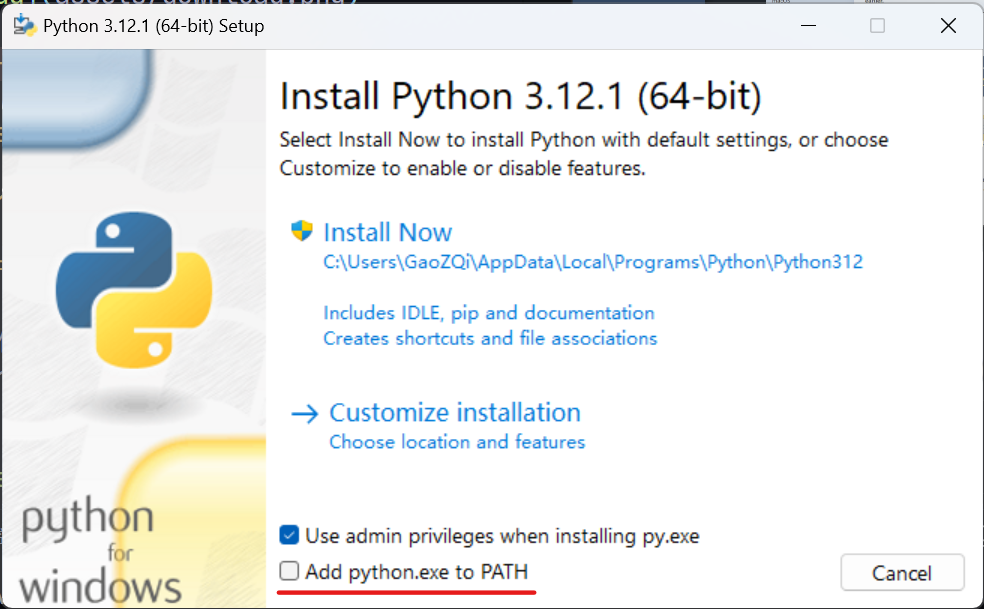
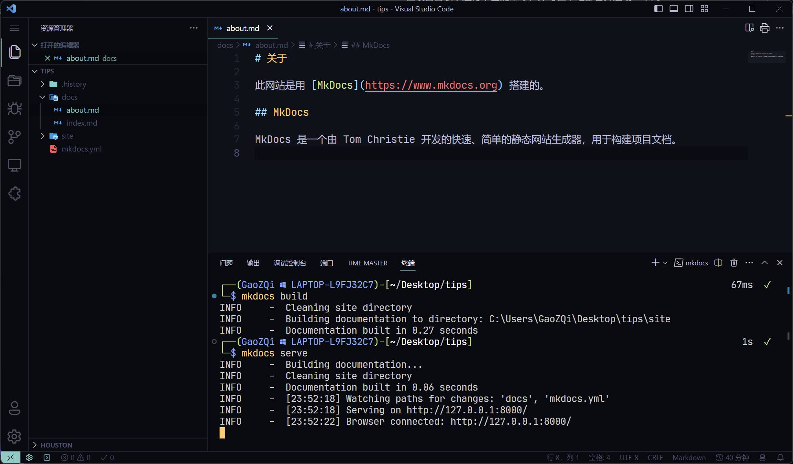

# 开始使用 Mkdocs 搭建个人网站

!!! info "参考文章和网站"
    + [Mkdocs官网](https://www.mkdocs.org/)
    + [Mkdocs中文文档](https://markdown-docs-zh.readthedocs.io/zh_CN/latest/#)
    + [鹤翔万里的笔记本-mkdocs 使用记录](https://note.tonycrane.cc/cs/tools/mkdocs/#mkdocs)

!!! note "前置知识"
    + Markdown 语法
    + Python 的使用
    + pip 换源

## 基础准备

在使用 Mkdocs 之前需要准备搜需要的环境和工具，下面的步骤均在 Windows 环境完成。

如果以及安装过相关环境和工具，可以跳过对应的步骤。

### 搭建 Python 环境

Mkdocs 是一个基于 Python 的工具，所以在使用之前需要先搭建 Python 环境。

#### 下载 Python

通过浏览器访问[Python官网](https://www.python.org/)，在 **Downloads** 选项卡中点击 "Download for Windows" 下方的的按钮下载 Python 。


#### 安装Python

下载完成后运行文件，按照提示安装即可。



注意勾选下方的 "Add python.exe to PATH" ！

安装完毕后，在桌面右键打开终端输入下面的指令，查看 Python 版本。

```shell
python -V
```


如果显示了 Python 的版本号，则说明安装成功。

### 准备一款文字编辑器

在编写文档时，需要使用一款文字编辑器，这里推荐使用：

+ [Visual Studio Code](https://code.visualstudio.com/)。
+ [Typora](https://typoraio.cn/)

## 安装 Mkdocs

在终端中输入下面的指令，即可安装 Mkdocs。

```shell
pip install mkdocs
```

如果遇到了网络问题，可以通过换源的方式解决。

## 搭建一个Mkdocs项目

### 创建新项目

选择你要存储项目的目录，然后运行下面的命令，即可新建一个空项目：

```shell
mkdocs new [dir-name] # 文件夹名字
```


打开新生成的文件夹，可以看到创建的文件目录结构如下：

```text
[dir-name]
    ├──docs
    │   └──index.md
    └──mkdocs.yml
```

其中在`docs`文件夹中存放着所有文档的源文件（Markdown文件），例如其中的`index.md`文件就是默认的首页文件。

打开`index.md`文件，可以看到默认的内容如下：

```markdown title="index.md"
# Welcome to MkDocs

For full documentation visit [mkdocs.org](https://www.mkdocs.org).

## Commands

* `mkdocs new [dir-name]` - Create a new project.
* `mkdocs serve` - Start the live-reloading docs server.
* `mkdocs build` - Build the documentation site.
* `mkdocs -h` - Print help message and exit.

## Project layout

    mkdocs.yml    # The configuration file.
    docs/
        index.md  # The documentation homepage.
        ...       # Other markdown pages, images and other files.
```

其中介绍了[Mkdocs的官方文档](https://www.mkdocs.org)和使用中会用到的基础指令以及项目的目录结构。

打开`mkdocs.yml`文件，可以看到默认的配置如下：

```yaml title="mkdocs.yml"
site_name: My Docs
```

后续对网站的一些配置内容，都会添加在这个文件中具体详情可以参考官方介绍[Mkdocs-配置](https://www.mkdocs.org/user-guide/configuration/)。

### 添加页面

在`docs`文件夹中添加一个新的Markdown文件，例如`about.md`，然后在其中添加一些内容：

```markdown title="about.md"
# 关于

此网站是用 [MkDocs](https://www.mkdocs.org) 搭建的。

## MkDocs

MkDocs 是一个由 Tom Christie 开发的快速、简单的静态网站生成器，用于构建项目文档。

```

编写完成后，保存文件，然后运行下面的命令，将写好的页面，构建成网站文件。

```shell
mkdocs build
```


发现在目录下生成了一个`site`文件夹，其中存放着构建好的网站文件。

### 本地预览网站

在项目目录下运行下面的命令，即可在本地部署并启动一个网站预览服务。

```shell
mkdocs serve
```



!!! note "提示"
    在运行本地部署命令`mkdocs serve`时会自动检测文件的变化，如果有变化则会自动重新构建网站文件，所以在编写文档时，可以在本地预览服务中实时查看效果。

通过浏览器访问`http://127.0.0.1:8000/`即可查看网站效果。


其中添加的`about.md`页面也已经显示在了导航栏中。


至此，一个简单的Mkdocs项目就搭建完成了。
