# 小行星带1~11

## 01⭐

??? info "题目"

    【你好！】一个电子声音在飞船内部响起。

    “你是谁？”你吓了一跳，环顾四周，想找出声音的来源。

    【我是CCBC飞船随船装载的人工智能，CCBC-AI，你也可以叫我希艾。】你面前的小行星资料屏幕似乎闪动了一下。【我的专职是协助矿的开采，平常我是处于休眠状态。但是就在刚才，飞船主机探测到了矿的存在，所以唤醒了我。】

    你：“太好了！我真愁不知从何下手呢。”

    希艾：【我会尽力协助你的。请稍候，让我查看一下你的资料……咦？】

    希艾：【你的资料显示你是一名刚入职的新人，虽然完成了驾驶飞船的培训，但是尚未完成开采矿的培训。】

    你：“我也没想到我还得挖矿啊！当初CCBC职位说明可不是这么说的……T_T”

    希艾：【别担心，开采矿很简单的，我可是CCBC的特级教官呢，现在就来给你进行一个简易的紧急培训。】

    希艾：【在开始之前，需要先说明一下。保留完善的科研笔记，详实地记录开采矿过程中的一切发现，是一个优秀的科研人员应有的良好习惯。这些笔记将会成为你和你同事宝贵的资料，总有一天会用上的，那时你会感谢我的。】

    希艾：【第一：】

    希艾：【请你打开 [CCBC 13 比赛简介](https://ccbc13.cipherpuzzles.com/info/about)，找到“比赛须知”，认真阅读所有说明。】

    你：“嗯？什么比赛？”

    希艾：【不要纠结细节……读完了吗？好的，为了证明你读完并且默认同意CCBC中心的规定，**请在提交框里输入比赛须知里唯一的一个英文单词**。】

    眼前闪过一道黄光，远处的小行星仿佛有了一些改变。

    希艾：【看来你也感受到了，这就是矿的共鸣。虽然不能直接转化为能量，但是共鸣里可能携带重要信息，所以请一定要留意。】

    希艾：【开采器可以自动探测到共鸣模式的存在。除此之外，有些矿里出现**橙色**文本时，表示该部分解开后可以获得共鸣。（但并不是所有共鸣模式都以此方式体现。）】

    希艾：【第二：】

    希艾：【人力挖矿的时代已经过去了，我们现在讲究的是科学挖矿。通过联网你可以找到许多能够帮助你分析矿的工具，CCBC中心的网站上的“工具推荐”里就有不少。我们现在来练习一下几个基本的工具。】

    希艾：【Nutrimatic 是一个非常好用的搜索英文单词或者短语的工具。】

    希艾：【在 [Nutrimatic](https://nutrimatic.org/) 里，< > 表示将角括号里的内容重新排序成有意义的单词。例如输入 <aenrsw> 就能查到 answer 这个单词。】

    希艾：【注意 Nutrimatic 区分大小写。小写字母只匹配本身。大写A可以匹配任何字母。举个例子：aAsAeA 可以匹配第一个字母是 a, 第三个字母是 s, 第五个字母是 e，而第2、4、6位可以是任何字母的结果。在 Nutrimatic 输入 aAsAeA 也可以查到 answer。】

    希艾：【Nutrimatic 还可以将几个条件用 & 连起来，只返回满足所有条件的词语。例如 <aenrsw>&aAsAeA 就是取以上两个结果的交集。】

    希艾：【根据上面所说，**请找到一个由 einprs 字母组成，并且第二位字母是 n 的单词**。】

    你：“哇，Nutrimatic 可太强大了！只是为什么它返回的内容还有好多意义不明的……”

    希艾：【的确，一般看最上面的字体最大的那几个搜索结果就好。Nutrimatic 还有很多用法，你要用心领会。】

    希艾：【第三：】

    希艾：【下面介绍 [quipqiup](https://quipqiup.com/)，暴力单表替换的神器！】

    希艾：【当然，这只能用来解英文句子，把密文贴进去点 Solve 就可以。】

    你：【这也太简单了吧！】

    希艾：【看来你学得很快嘛，那你来试试这个：**idears we excelsiors**。】

    希艾：【顺便说一句，字母替换字母仅仅是最基础的单表表现方式，也有可能是符号或者其它什么替换字母。如果你发现一段密文里出现的符号少于等于26并且有规律的空格间隔，那么就可以考虑它是英文单表替换的可能性。】

    希艾：【第四：】

    希艾：【好了，下面介绍的是一个非常好用及全面的 puzzle 工具集，[焖肉面](https://puzz.cipherpuzzles.com/cipher_machine/)！包含了一些英文暴力，古典密码，以及其它解谜工具，应该对你这次旅行很有帮助。】

    你：“一听就很好吃……”

    希艾：【的确，讲到好吃的焖肉面嘛，就让我想起非常不好吃的凯撒色拉……】

    你：“人工智能还吃东西？”

    希艾（无视了你）：【讲到凯撒色拉，那我们就来讲讲凯撒移位吧。这在焖肉面的“古典密码”下有暴力解法。】

    你：“我知道你又要给我出题了，是什么快说吧。”

    希艾：【**drsc hdsaflwpl hrm's uybadfmzf lotj esp xrl**。】

    你：“So easy... 嗯？明文不重要？那答案是啥？”

    希艾：【Not so easy吧！有的时候矿会使用一些遮眼法来把自己藏得更深。终点不一定是最重要的，也有可能是过程。】

    你：“懂了懂了。还有吗？”

    希艾：【当然还有很多其他的好用的工具，但这不是速成班吗，我也没法全讲完，你自己慢慢发掘吧！】

    希艾：【第五：】

    希艾：【如果真的在某处卡住了，不要过于沮丧。可以跟你队友沟通，可以看看别的题目换换脑子，可以休息一下吃吃喝喝睡睡……】

    希艾：【还有：你不是一个人在战斗，你的身后是整个CCBC中心！**不要忘了你可以通过HINT向中心求助。**】

    你：“好的我现在就卡了，我这就求助！”

    希艾：【第一次求助，我就偷偷动用一下我的教官权限，给你打个折吧。】

    你：“谢谢！”

    希艾：【最后：】

    希艾：【工具再全也不能替代你的头脑。当我们有了一系列的线索（也就是五个单词，顺便说一句，在本题你可以分别提交每个单词，如有共鸣则说明你的答案正确）时，我们需要找到的就是一些规律、共同点等等。】

    希艾：【这里需要进行一些联想，搜索……以及注意到题目里比较明显的梗或者流行文化的引用，也有可能是一种提示。】

    你：“嗯？什么梗？”

    希艾：【哦，我忘讲了，现在就补上！】

    希艾（电子音突然变成少年的声音）：【**真相永远只有一个！**】

    希艾（恢复了原本的声音）：【今年正好是第26部剧场版了呢……】

    希艾：【如果解出一些数字且都在 1-26 的范围，可以按照 1=A、2=B……26=Z 将其翻译成英文字母。这是矿常用的掩藏自己的手法。】

    你：“能不能说清楚一点？”

    希艾：【我也想，但是我没时间了……】

    你：“嗯？你这什么意思？你不是说你要尽全力协助我吗？”

    希艾（虽然你看不见它，但是你能感到它故作坚强的微笑）：【由于飞船能量过低，刚才这段教程已经是我的极限了。】

    希艾：【但是我相信你能做到！】

    希艾：【加油！】

    希艾：【……】

??? warning "HINT"

    1. 希艾的馈赠（原价10000Q，打折后0Q）

        **NIGHTMARE**

    2. 该如何提取？

        每个小题答案对应柯南剧场版中的一部（的英文标题）

??? success "解析"

    1. 请在提交框里输入比赛须知里唯一的一个英文单词。

        查看网页得到答案是bug，提交答案。

        > 感谢你阅读CCBC的比赛须知，作为奖励，特此颁发答案 **WIZARD**。

    2. 请找到一个由 einprs 字母组成，并且第二位字母是 n 的单词

        利用Nutrimatic 查询**<einprs\>&AnAAAAA**，得到**sniper**。

    3. idears we excelsiors

        利用quipqiup单表替换暴力破解，得到answer is **skyscraper**。

    4. drsc hdsaflwpl hrm's uybadfmzf lotj esp xrl。

        1. 利用焖肉面中凯撒密码暴力破解，得到一句话：

            this plaintext isn't important find the key。

        2. 对应每个单词的凯撒位移所用的key

            16 8 1 14 20 15 13

        3. 根据题干提示，将每个数字转化为字母，得到**phantom**。

    5. 不要忘了你可以通过HINT向中心求助

        利用HINT，得到**NIGHTMARE**。

    6. 真相永远只有一个！

        查找柯南剧场版，按照顺序找到含有上面单词的剧场版编号，将其转化为字母，得到**carft**。
        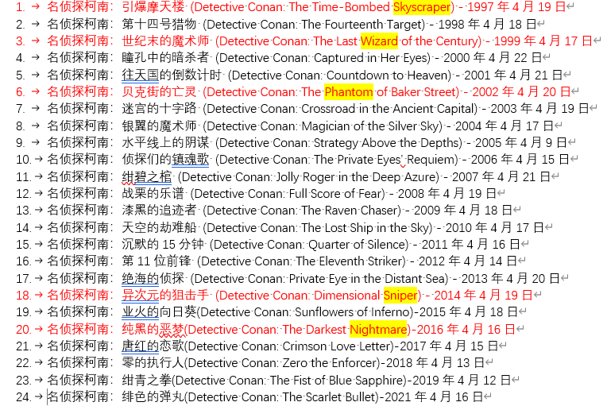{: high="50%" width="50%" align="center"}

## 02⭐

??? info "题目"

    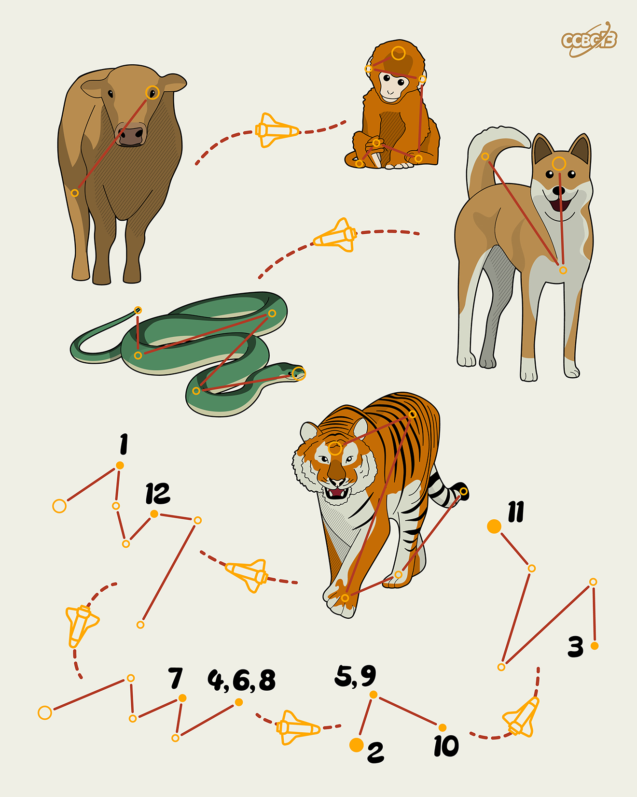

??? warning "HINT"

    1. 题目里的图片分别对应什么单词？

        **OX, MONKEY, DOG, SNAKE, TIGER**

    2. 还有额外的提示吗？
    
        **生肖里的“鸡”一般翻译成ROOSTER。**

??? success "解析"

## 03⭐

??? info "题目"

    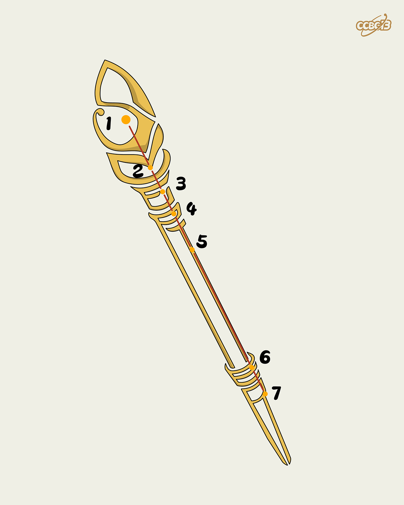

??? warning "HINT"

??? success "解析"

## 04⭐

??? info "题目"

    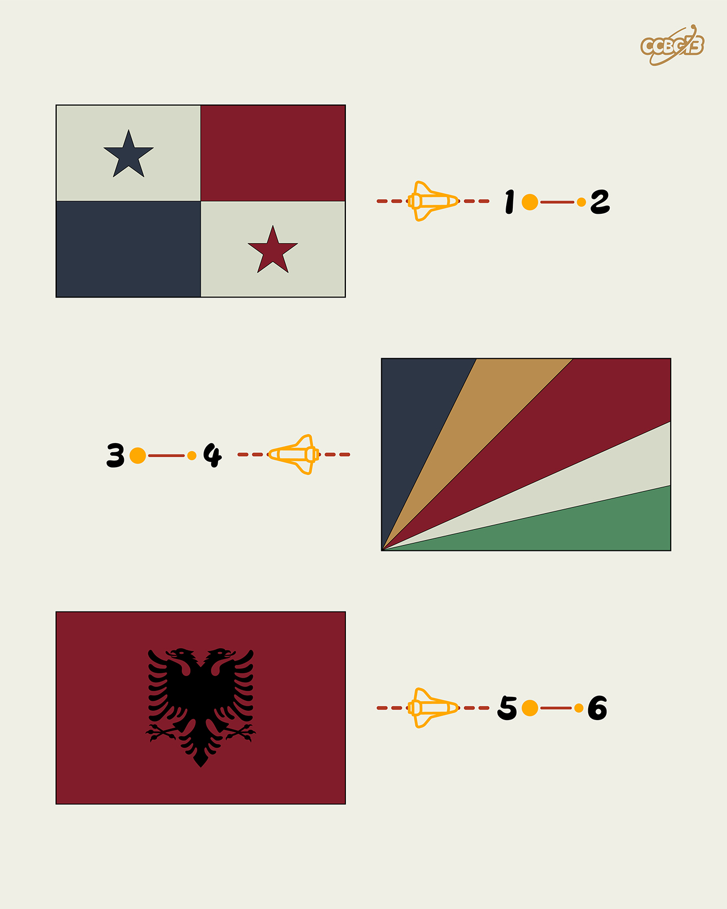

??? warning "HINT"

??? success "解析"

## 05⭐

??? info "题目"

    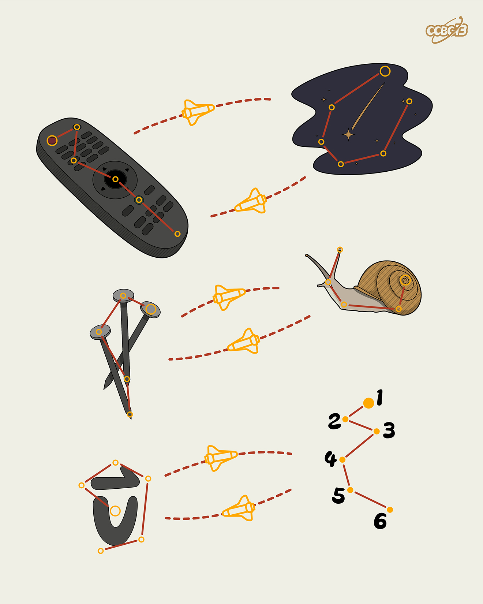

??? warning "HINT"

??? success "解析"

## 06⭐

??? info "题目"

    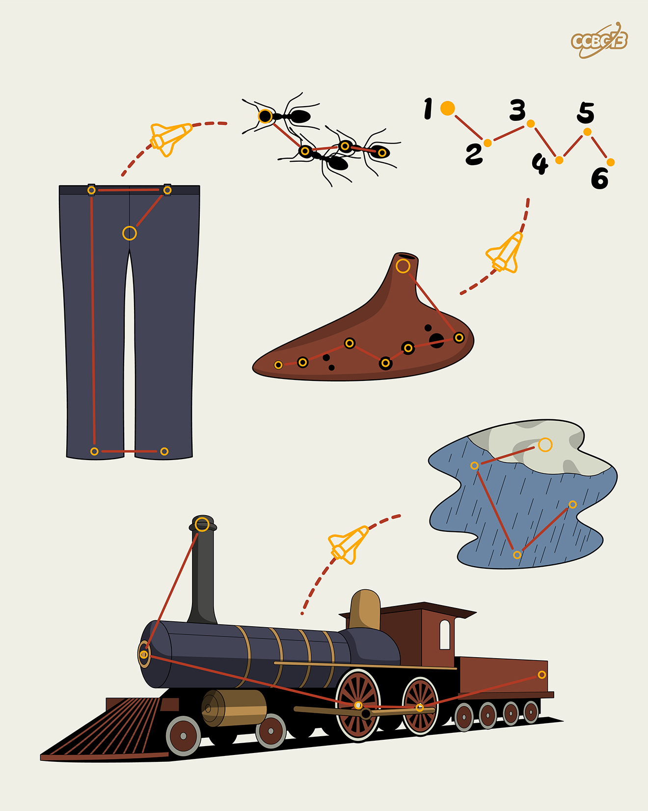

??? warning "HINT"

??? success "解析"

## 07⭐

??? info "题目"

    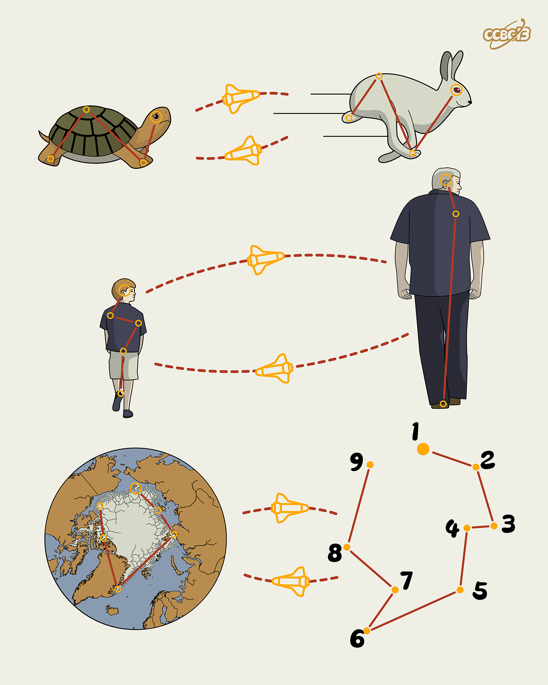

??? warning "HINT"

??? success "解析"

## 08⭐

??? info "题目"

    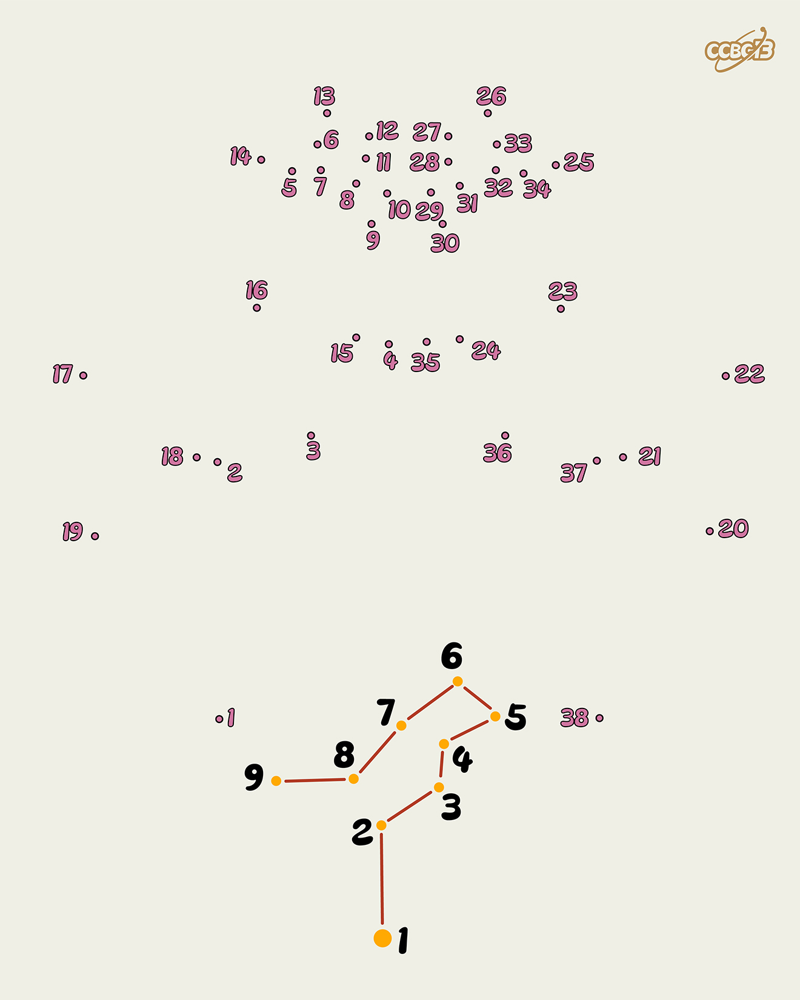

??? warning "HINT"

??? success "解析"

## 09⭐

??? info "题目"

    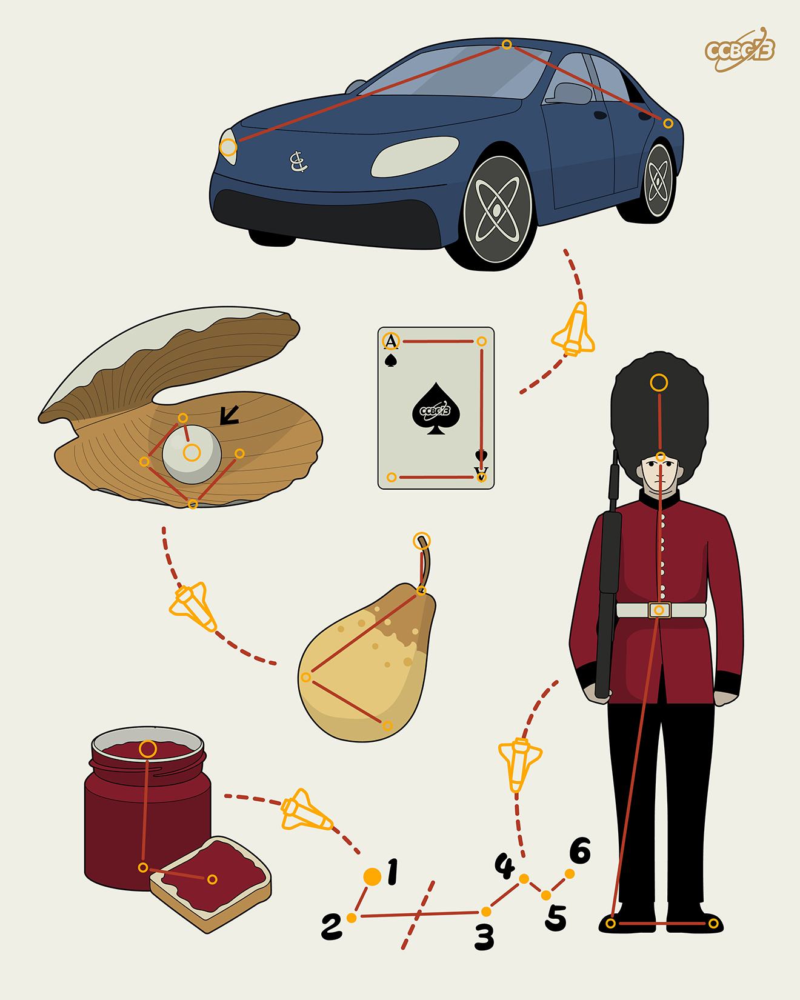

??? warning "HINT"

??? success "解析"

## 10⭐

??? info "题目"

    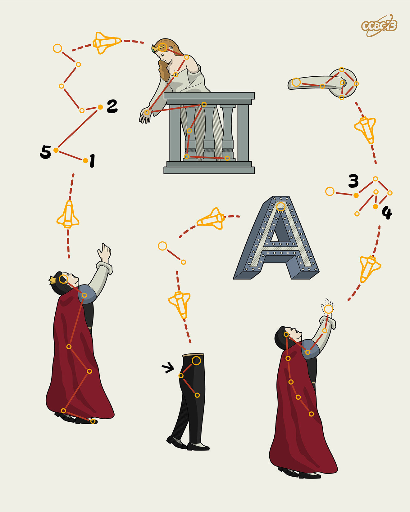

??? warning "HINT"

??? success "解析"

## 11⭐

??? info "题目"

    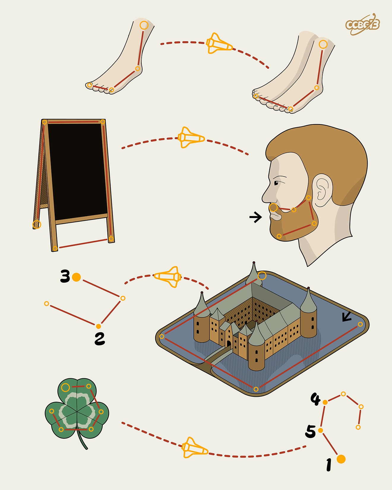

??? warning "HINT"

??? success "解析"

---
[:material-backburger: 返回小行星带](index.md)