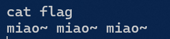

# 2023年网络空间安全实验技能竞赛（下午场）Writeup


## Misc

### 签到

> 欢迎来到CTF。为了得取题目的分值，你需要通过题目给出的条件找寻特殊字符串。除非题目另行说明，否则通常是以`flag`开头的、以大括号`{ }`包裹的字符串。
>
> 关注公众号`网联三航 安守四方`并发送`flag`获取本题`flag`

>  附件:
>
> 

在公众号发送`flag`,获得flag


### base

> base家族！

> 附件:
>


打开获得一串文本:

```txt
4C4A575851324332474E32475554544B4A5A5746555632574E524E45474D4C4E4C4A445645334B4D4B5249584F5453584B5632465356435A504A4847534D4C494C4A43475132435A504A4647535453484B5532453652325348453D3D3D3D3D3D
```

利用https://cyberchef.org/自动破解得到flag


### ;;what;;is;;this;;?

> 附件:
>


里面有加密脚本

```python
import random
 
L = 8
perm = range(L)
random.shuffle(perm)
 
msg = open("/flag").read().strip()
while len(msg) % (2*L):
    msg += ";"
 
for i in xrange(100):
    msg = msg[1:] + msg[:1]
    msg = msg[0::2] + msg[1::2]
    msg = msg[1:] + msg[:1]
    res = ""
    for j in xrange(0, len(msg), L):
        for k in xrange(L):
            res += msg[j:j+L][perm[k]]
    msg = res
print (msg)
```

打开实例,拿到加密后的文本


`__Ic3W4w01A3;;9fmNla6;f;_}ga;O7_3Tl;z;;765;{;;;S`

**根据脚本尝试写破解脚本,观察到`perm`被随机排列,首先构造脚本尝试爆破`perm`的值:**

+ 观察到加密脚本第一步会在字符串后面添加`;`是其长度可以被16整除
  + 统计分号个数为12
  + 密文总长度48
  + 算出明文长度应为36
+ 同时明文满足`flag{...}`的特征
  + 统计其中`g, {, }`出现次数为一
  + 构造特征字符串`flag{012345678901234567890123456789};;;;;;;;;;;;`
  + 通过加密判断特征字符出现位置与密文是否相同

>  解密脚本
>
> ```python
> import itertools
> L = 8
> perm = [0, 1, 2, 3, 4, 5, 6, 7]
> #将perm全排列
> permutations = list(itertools.permutations(perm))
> 
> for p in permutations:
>     msg='flag{012345678901234567890123456789};;;;;;;;;;;;'
>     # 原加密部分
>     for i in range(0, 100):
>         msg = msg[1:] + msg[:1]
>         msg = msg[0::2] + msg[1::2]
>         msg = msg[1:] + msg[:1]
>         res = ""
>         for j in range(0, len(msg), L):
>             for k in range(0,L):
>                 res += msg[j:j+L][p[k]]
>         msg = res
> 
>     # __Ic3W4w01A3;;9fmNla6;f;_}ga;O7_3Tl;z;;765;{;;;S
> 
>     if msg[26] == 'g' and msg[43] == '{' and msg[25] == '}':
>         print (msg)
>         open('flag.txt','a').write(msg+' '+str(p)+'\n')
> ```
>

>
> `664891f;6421;049857a0;;2;}g3;39175l;3857;2;{;;;0 (1, 0, 3, 7, 4, 2, 5, 6)`
> `86489;1;3421;;90157a06079}g3;456f5l;3;;;;2;{;782 (1, 0, 3, 7, 4, 2, 6, 5)`
> `86489406;421;9;1557a0;;f2}g3;86;75l;331792;{;;;0 (1, 0, 3, 7, 4, 5, 2, 6)`
> `f64890123421;890;57a06789}g3;41675l;35;;;2;{;;;; (1, 0, 3, 7, 4, 5, 6, 2)`
> `16489;98;421;;07;57a0;606}g3;7;f35l;358;22;{;419 (1, 0, 3, 7, 4, 6, 2, 5)`
> `;6489;;2;421;795857a0f691}g3;1;735l;368402;{;;;0 (1, 0, 3, 7, 4, 6, 5, 2)`
> `264890108421;896;57a067;3}g3;45195l;3;;7;2;{;;;f (2, 0, 3, 7, 4, 1, 5, 6)`
> `;64890077421;;94;57a0;29;}g3;116;5l;3f85;2;{;368 (2, 0, 3, 7, 4, 1, 6, 5)`
> `264896908421;;;6;57a070;3}g3;;4195l;3817;2;{;;5f (2, 0, 3, 7, 4, 5, 1, 6)`
> `464896;98421;16f;57a02;;3}g3;01;95l;3577;2;{;08; (2, 0, 3, 7, 4, 5, 6, 1)`
> `964894062421;;;1557a0738f}g3;;0;;5l;3891;2;{;67; (2, 0, 3, 7, 4, 6, 1, 5)`
> `064896803421;61;757a0;f89}g3;;4175l;3;9;;2;{;2;5 (2, 0, 3, 7, 4, 6, 5, 1)`
> `;64890;7;421;965457a09;10}g3;76385l;382f;2;{;1;; (5, 0, 3, 7, 4, 1, 2, 6)`
> `764890024421;;68157a0;f;9}g3;15375l;3;;962;{;;;8 (5, 0, 3, 7, 4, 1, 6, 2)`
> `f6489;793421;819;57a0;286}g3;4;6;5l;300;52;{;71; (5, 0, 3, 7, 4, 2, 1, 6)`
> `f64890123421;890157a06789}g3;45675l;3;;;;2;{;;;; (5, 0, 3, 7, 4, 2, 6, 1)`
> `664899;21421;3;9f57a0;16;}g3;;8405l;305;;2;{;877 (5, 0, 3, 7, 4, 6, 1, 2)`
> `f64890123421;890157a06789}g3;45675l;3;;;;2;{;;;; (5, 0, 3, 7, 4, 6, 2, 1)`
> `664890;;0421;919757a01;2;}g3;8f475l;3;6;32;{;85; (6, 0, 3, 7, 4, 1, 2, 5)`
> `964890123421;891057a067;f}g3;45675l;3;;;;2;{;;;8 (6, 0, 3, 7, 4, 1, 5, 2)`
> `66489;8;;421;f19;57a0090;}g3;68575l;31;232;{;47; (6, 0, 3, 7, 4, 2, 1, 5)`
> `66489092;421;41;857a07;31}g3;;9575l;36;;02;{;f;8 (6, 0, 3, 7, 4, 2, 5, 1)`
> `964896923421;;;1057a070;f}g3;;4675l;381;;2;{;;58 (6, 0, 3, 7, 4, 5, 1, 2)`
> `;64898206421;48;157a0f7;9}g3;93175l;35;;;2;{;06; (6, 0, 3, 7, 4, 5, 2, 1)`

再次观察分号特征,选出唯一符合条件的结果:

`764890024421;;68157a0;f;9}g3;15375l;3;;962;{;;;8 (5, 0, 3, 7, 4, 1, 6, 2)`

**根据`perm`编写破解脚本：**

> 破译脚本
>
> ```python
> L = 8
> # 原perm = [5, 0, 3, 7, 4, 1, 6, 2]
> # 求逆perm = [1, 5, 7, 2, 4, 0, 6, 3]
> perm = [1, 5, 7, 2, 4, 0, 6, 3]
> # 密文
> encrypted_msg = "__Ic3W4w01A3;;9fmNla6;f;_}ga;O7_3Tl;z;;765;{;;;S"
> # 明文
> msg = ''
> 
> for i in range(100):
>     msg=''
>     # 第一步将密文按照求逆perm的顺序排列
>     for j in range(0,len(encrypted_msg),L):
>         for k in range(L):
>             msg += encrypted_msg[j:j+L][perm[k]]
> 
>     # 第二步将密文左移一位
>     msg = msg[47:] + msg[:47]
>     encrypted_msg = msg
>     
>     # 将密文前24与后24交错拼接
>     msg=''
>     for s in range(0,24):
>         msg += encrypted_msg[s]+encrypted_msg[s+24]
>     
>     # 将密文左移一位
>     msg = msg[47:] + msg[:47]
>     encrypted_msg = msg
> 
> print(msg.strip(";"))
> 
> ```

获得`flag{WOw_IT_lS_4mAz1N6_f7635a0793c3}`

## Crypot

### rot13

> 1Ebbg8Vf7Abg3Nyybjrq

根据题干通过`rot13`破解获得　flag：`1root8is7not3allowed`

### 山岚

> 山岚f5-lf5aa9gc9{-8648cbfb4f979c-c2a851d6e5-c}

猜测为栅栏密码选择爆破`flag{6cb9c256-5fac-4b47-a1ec-59988ff9c8d5}`

### Rsa Roll

> 附件：
>

>
> 题目：
>
> RSA roll！roll！roll！
> Only number and a-z
> （don't use editor
> which MS provide）
>
> data：
>
> {920139713,19}
>
> 704796792
> 752211152
> 274704164
> 18414022
> 368270835
> 483295235
> 263072905
> 459788476
> 483295235
> 459788476
> 663551792
> 475206804
> 459788476
> 428313374
> 475206804
> 459788476
> 425392137
> 704796792
> 458265677
> 341524652
> 483295235
> 534149509
> 425392137
> 428313374
> 425392137
> 341524652
> 458265677
> 263072905
> 483295235
> 828509797
> 341524652
> 425392137
> 475206804
> 428313374
> 483295235
> 475206804
> 459788476
> 306220148

data很有特点~~直接搜[BUUCTF中Crypto的RSAROLL](https://blog.csdn.net/xiao__1bai/article/details/123567209)~~

获得`flag{13212je2ue28fy71w8u87y31r78eu1e2}`

### 维吉尼亚

> 小明发出来一串密文c：lvbcfstfly，他发出的明文m是什么？ flag{m} 题目提示：{34 18 25 13 36 13 14 13 vghn 0ol 12wa qwsz lkjn}

根据提示后面字母投射到键盘


获得密钥`bpqam`，获得明文`kglctreplm`

## Pwn

### miao~

> 帮我找找我的修猫

> 附件：

> hint：签到题还想要提示？

用IDA Pro(x64)打开：


注意到后面`system("/bin/sh");`

打开实例运行：


输入`cat flag`，发现被过滤：



通过`tac flag`成功绕过：


## Web

### cms

> [http://10.60.19.105](http://10.60.19.105/)
>
> 本题难度下降，分数下降

使用`dirsearch`扫描目录，发现`/phpinfo.php`，搜索`flag`


# 2023年网络空间安全实验技能竞赛（上午场）Writeup

## Misc

### linuxquestion

> 查找名字包含GenerateCipher的应用程序xxx，其可读可执行且大小大于100000c。
>
> 执行上述程序，输入自己的学号获得密文。
>
> 查找系统定时任务，阅读定时执行的脚本。
>
> xxx应用程序使用与定时任务脚本相同的加密方法，请编写脚本，对步骤2获得的密文解密得到明文。flag形式为flag{xxxxx} 
>
> ssh用户名口令如下 linuxexam cs2023

1.第一步查找名字包含GenerateCipher的应用程序xxx，其可读可执行且大小大于100000c。

```bash
find / -type f -name "*GenerateCipher*" -perm /u+rx -size +100000c 2>/dev/null
```

得到`/etc/linuxexam_GenerateCipher/GenerateCipher6`

运行输入学号获得密文：`TpE2EfEdTpi3EpXrTZi1SJA1TCE0SfAfSfOfSJSeSfS3FJOcTfq2Fpi1TfO0UZW0S2KfSpScSfOfSpSfSfGfSfSdSfqfSG==`

2.查找系统定时任务，阅读定时执行的脚本。

```bash
cd /etc/cron.d/
vim ./cronjob_linuxexam
```

获得加密脚本路径`/usr/bin/encrypto.sh`

查看加密脚本
```shell
#!/bin/bash

# 加密函数
_cipher() {
    local text="$1"
    local shift="$2"
    local result=""
    for ((i=0; i<${#text}; i++)); do
        char="${text:i:1}"
        if [[ "$char" =~ [a-zA-Z] ]]; then
            if [[ "$char" =~ [a-z] ]]; then
                ascii_offset=97
            else
                ascii_offset=65
            fi
            ascii_code=$(printf "%d" "'$char")
            shifted_code=$(((ascii_code - ascii_offset + shift) % 26 + ascii_offset))
            shifted_char=$(printf "\\$(printf '%03o' "$shifted_code")")
            result+="$shifted_char"
        else
            result+="$char"
        fi
    done

    echo "$result"
}

# 加密明文
encrypt_plaintext() {
    local plaintext="$1"
    local encoded_text=$(echo -n "$plaintext" | xxd -p | tr -d '\n')
    local encrypted_text=$(echo "$encoded_text" | base64 | tr -d '\n')
    local ciphertext=$(_cipher "$encrypted_text" 15)
    echo "$ciphertext"
}

# 主函数
main() {
    read -p "请输入明文: " plaintext
    ciphertext=$(encrypt_plaintext "$plaintext")
    echo "加密得到的密文: $ciphertext"
}

# 执行主函数
main
```

分析加密过程：

+ 将文本转成16进制编码
+ base64加密
+ 恺撒密码，位移数15

3.应用程序使用与定时任务脚本相同的加密方法，编写脚本

```：python
# TpE2EfEdTpi3EpXrTZi1SJA1TCE0SfAfSfOfSJSeSfS3FJOcTfq2Fpi1TfO0UZW0S2KfSpScSfOfSpSfSfGfSfSdSfqfSG==

import base64

def decrypt(text, shift):
    result = ""
    for char in text:
        if char.isalpha():
            ascii_offset = 97 if char.islower() else 65
            ascii_code = ord(char)
            shifted_code = ((ascii_code - ascii_offset - shift) % 26) + ascii_offset
            shifted_char = chr(shifted_code)
            result += shifted_char
        else:
            result += char
    return result

def brute_force_decrypt(text):
    for shift in range(26):  # 尝试所有可能的位移量
        decrypted_text = decrypt(text, shift)
        try:
            decoded_text = base64.b64decode(decrypted_text).decode('utf-8')
            print("尝试位移量：", shift)
            print("解密后的文本：", decoded_text)
            ascii_output = ""
            for i in range(0, len(decoded_text), 2):
                hex_code = decoded_text[i:i+2]
                try:
                    ascii_char = chr(int(hex_code, 16))
                    ascii_output += ascii_char
                except ValueError:
                    pass  # 忽略数值错误
            print("转换为ASCII：", ascii_output)
        except (UnicodeDecodeError, ValueError):
            pass  # 忽略解码错误和数值错误


encrypted_text = input("请输入要解密的文本：")
brute_force_decrypt(encrypted_text)
```

> 输出：
>
> 请输入要解密的文本：`TpE2EfEdTpi3EpXrTZi1SJA1TCE0SfAfSfOfSJSeSfS3FJOcTfq2Fpi1TfO0UZW0S2KfSpScSfOfSpSfSfGfSfSdSfqfSG==`
> 尝试位移量： 6
> 解密后的文本： `666c61677b4e5750555f4353323032337d20796f757249443a32303232333033313930`
> 转换为ASCII： **flag{NWPU_CS2023}** yourID:2022303190

# Web

### HTTP响应码

根据提示需要找到两个302和404响应码的页面，

通过`curl`工具

```bash
curl -i http://ip:port/xxx
curl -i http://ip:port/hint
```


参看网页源代码获得两个flag

`flag{404--the-most-common-error-code}`

`flag{302--You-need-to-go-somewhere-else}`

### SQL注入

通过注入点注入获得`flag{michael1}`


