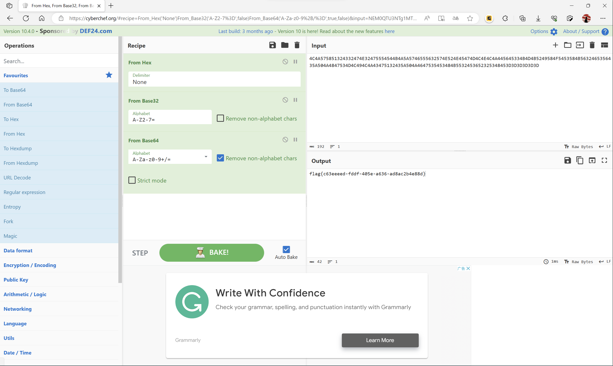
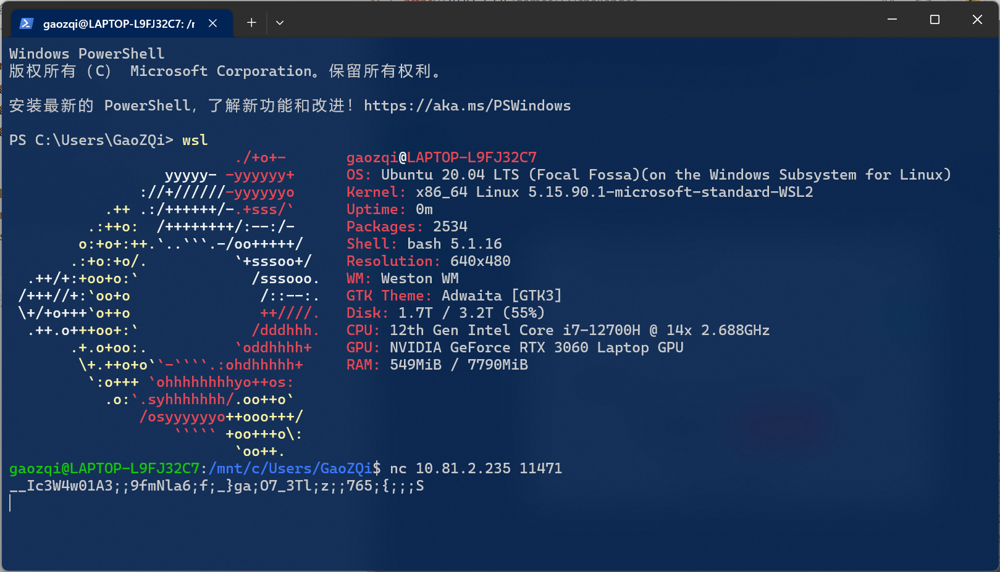
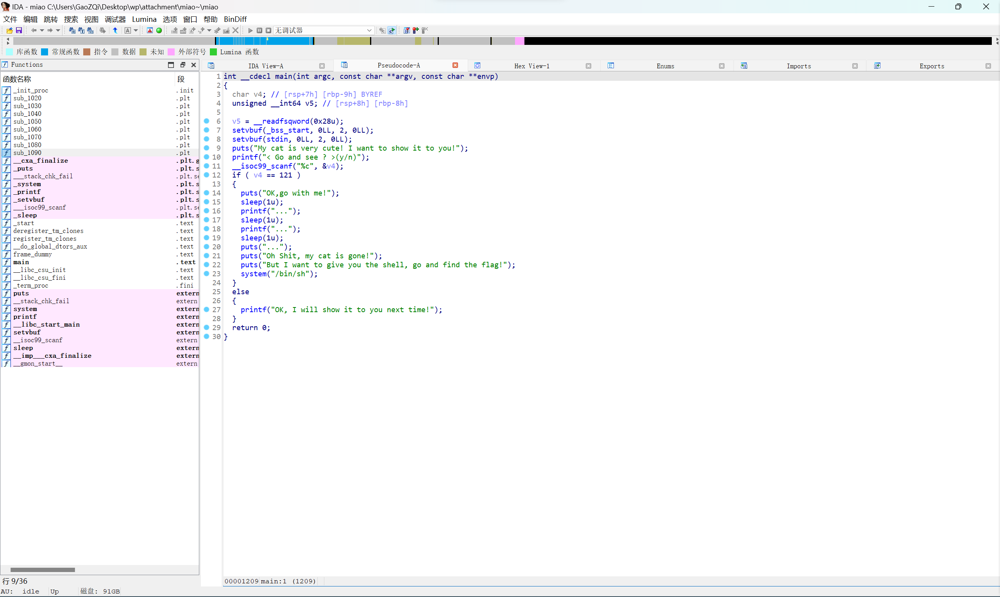
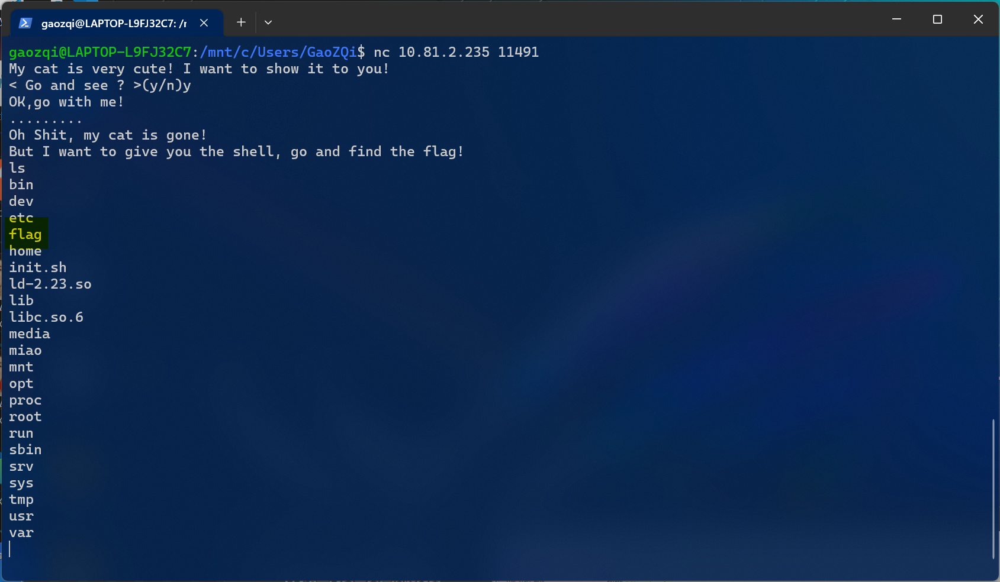
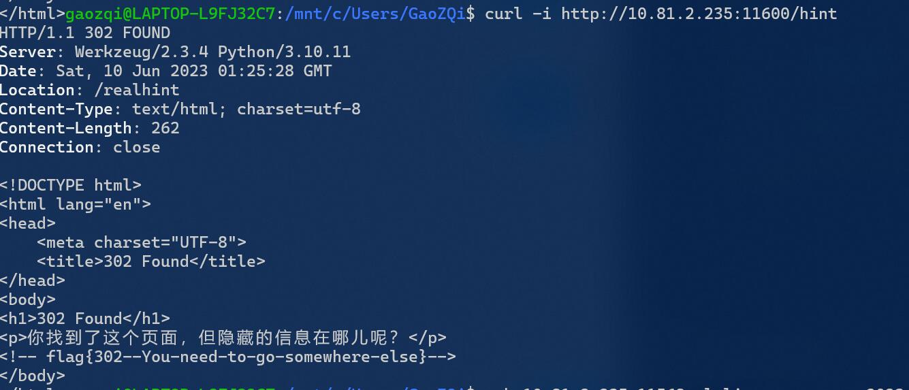

# 2023年网络空间安全实验技能竞赛 Writeup

## 2023年网络空间安全实验技能竞赛（下午场）Writeup

### Misc

#### 签到

???+ info "题目描述"

    欢迎来到CTF。为了得取题目的分值，你需要通过题目给出的条件找寻特殊字符串。除非题目另行说明，否则通常是以`flag`开头的、以大括号`{ }`包裹的字符串。

    关注公众号`网联三航 安守四方`并发送`flag`获取本题`flag`

    附件:
    
    

在公众号发送`flag`,获得flag


#### base

???+ info "题目描述"

    base家族！

    附件:
    ```txt
    4C4A575851324332474E32475554544B4A5A5746555632574E524E45474D4C4E4C4A445645334B4D4B5249584F5453584B5632465356435A504A4847534D4C494C4A43475132435A504A4647535453484B5532453652325348453D3D3D3D3D3D
    ```

利用 https://cyberchef.org/ 自动破解得到flag



#### ;;what;;is;;this;;?

???+ info "题目描述"

    ```python title=""
    import random
    
    L = 8
    perm = range(L)
    random.shuffle(perm)
    
    msg = open("/flag").read().strip()
    while len(msg) % (2*L):
        msg += ";"
    
    for i in xrange(100):
        msg = msg[1:] + msg[:1]
        msg = msg[0::2] + msg[1::2]
        msg = msg[1:] + msg[:1]
        res = ""
        for j in xrange(0, len(msg), L):
            for k in xrange(L):
                res += msg[j:j+L][perm[k]]
        msg = res
    print (msg)
    ```

打开实例,拿到加密后的文本



`__Ic3W4w01A3;;9fmNla6;f;_}ga;O7_3Tl;z;;765;{;;;S`

**根据脚本尝试写破解脚本,观察到`perm`被随机排列,首先构造脚本尝试爆破`perm`的值:**

+ 观察到加密脚本第一步会在字符串后面添加`;`是其长度可以被16整除
  + 统计分号个数为12
  + 密文总长度48
  + 算出明文长度应为36
+ 同时明文满足`flag{...}`的特征
  + 统计其中`g, {, }`出现次数为一
  + 构造特征字符串`flag{012345678901234567890123456789};;;;;;;;;;;;`
  + 通过加密判断特征字符出现位置与密文是否相同


```python title="解密脚本"
import itertools
L = 8
perm = [0, 1, 2, 3, 4, 5, 6, 7]
#将perm全排列
permutations = list(itertools.permutations(perm))

for p in permutations:
    msg='flag{012345678901234567890123456789};;;;;;;;;;;;'
    # 原加密部分
    for i in range(0, 100):
        msg = msg[1:] + msg[:1]
        msg = msg[0::2] + msg[1::2]
        msg = msg[1:] + msg[:1]
        res = ""
        for j in range(0, len(msg), L):
            for k in range(0,L):
                res += msg[j:j+L][p[k]]
        msg = res

    # __Ic3W4w01A3;;9fmNla6;f;_}ga;O7_3Tl;z;;765;{;;;S

    if msg[26] == 'g' and msg[43] == '{' and msg[25] == '}':
        print (msg)
        open('flag.txt','a').write(msg+' '+str(p)+'\n')
```
```txt title="输出" hl_lines="14"
664891f;6421;049857a0;;2;}g3;39175l;3857;2;{;;;0 (1, 0, 3, 7, 4, 2, 5, 6)
86489;1;3421;;90157a06079}g3;456f5l;3;;;;2;{;782 (1, 0, 3, 7, 4, 2, 6, 5)
86489406;421;9;1557a0;;f2}g3;86;75l;331792;{;;;0 (1, 0, 3, 7, 4, 5, 2, 6)
f64890123421;890;57a06789}g3;41675l;35;;;2;{;;;; (1, 0, 3, 7, 4, 5, 6, 2)
16489;98;421;;07;57a0;606}g3;7;f35l;358;22;{;419 (1, 0, 3, 7, 4, 6, 2, 5)
;6489;;2;421;795857a0f691}g3;1;735l;368402;{;;;0 (1, 0, 3, 7, 4, 6, 5, 2)
264890108421;896;57a067;3}g3;45195l;3;;7;2;{;;;f (2, 0, 3, 7, 4, 1, 5, 6)
;64890077421;;94;57a0;29;}g3;116;5l;3f85;2;{;368 (2, 0, 3, 7, 4, 1, 6, 5)
264896908421;;;6;57a070;3}g3;;4195l;3817;2;{;;5f (2, 0, 3, 7, 4, 5, 1, 6)
464896;98421;16f;57a02;;3}g3;01;95l;3577;2;{;08; (2, 0, 3, 7, 4, 5, 6, 1)
964894062421;;;1557a0738f}g3;;0;;5l;3891;2;{;67; (2, 0, 3, 7, 4, 6, 1, 5)
064896803421;61;757a0;f89}g3;;4175l;3;9;;2;{;2;5 (2, 0, 3, 7, 4, 6, 5, 1)
;64890;7;421;965457a09;10}g3;76385l;382f;2;{;1;; (5, 0, 3, 7, 4, 1, 2, 6)
764890024421;;68157a0;f;9}g3;15375l;3;;962;{;;;8 (5, 0, 3, 7, 4, 1, 6, 2)
f6489;793421;819;57a0;286}g3;4;6;5l;300;52;{;71; (5, 0, 3, 7, 4, 2, 1, 6)
f64890123421;890157a06789}g3;45675l;3;;;;2;{;;;; (5, 0, 3, 7, 4, 2, 6, 1)
664899;21421;3;9f57a0;16;}g3;;8405l;305;;2;{;877 (5, 0, 3, 7, 4, 6, 1, 2)
f64890123421;890157a06789}g3;45675l;3;;;;2;{;;;; (5, 0, 3, 7, 4, 6, 2, 1)
664890;;0421;919757a01;2;}g3;8f475l;3;6;32;{;85; (6, 0, 3, 7, 4, 1, 2, 5)
964890123421;891057a067;f}g3;45675l;3;;;;2;{;;;8 (6, 0, 3, 7, 4, 1, 5, 2)
66489;8;;421;f19;57a0090;}g3;68575l;31;232;{;47; (6, 0, 3, 7, 4, 2, 1, 5)
66489092;421;41;857a07;31}g3;;9575l;36;;02;{;f;8 (6, 0, 3, 7, 4, 2, 5, 1)
964896923421;;;1057a070;f}g3;;4675l;381;;2;{;;58 (6, 0, 3, 7, 4, 5, 1, 2)
;64898206421;48;157a0f7;9}g3;93175l;35;;;2;{;06; (6, 0, 3, 7, 4, 5, 2, 1)
```

再次观察分号特征,选出唯一符合条件的结果:

```
764890024421;;68157a0;f;9}g3;15375l;3;;962;{;;;8 (5, 0, 3, 7, 4, 1, 6, 2)
```

**根据`perm`编写破解脚本：**


```python title="破译脚本"
L = 8
perm = [1, 5, 7, 2, 4, 0, 6, 3] #求逆prem(1)
# 密文
encrypted_msg = "__Ic3W4w01A3;;9fmNla6;f;_}ga;O7_3Tl;z;;765;{;;;S"
# 明文
msg = ''

for i in range(100):
    msg=''
    # 第一步将密文按照求逆perm的顺序排列
    for j in range(0,len(encrypted_msg),L):
        for k in range(L):
            msg += encrypted_msg[j:j+L][perm[k]]

    # 第二步将密文左移一位
    msg = msg[47:] + msg[:47]
    encrypted_msg = msg
    
    # 将密文前24与后24交错拼接
    msg=''
    for s in range(0,24):
        msg += encrypted_msg[s]+encrypted_msg[s+24]
    
    # 将密文左移一位
    msg = msg[47:] + msg[:47]
    encrypted_msg = msg

print(msg.strip(";"))

```

1. 逆置perm
    ``` python
    perm = [5, 0, 3, 7, 4, 1, 6, 2] #原perm 
    nperm = []
    for i in range(8):
        nperm.append(perm.index(i))
    ```

获得 `flag{WOw_IT_lS_4mAz1N6_f7635a0793c3}`

### Crypot

#### rot13

!!! info "题目"
    1Ebbg8Vf7Abg3Nyybjrq

根据题干通过`rot13`破解获得`flag{1root8is7not3allowed}`

#### 山岚

!!! info "题目"
    f5-lf5aa9gc9{-8648cbfb4f979c-c2a851d6e5-c}

猜测为栅栏密码选择爆破`flag{6cb9c256-5fac-4b47-a1ec-59988ff9c8d5}`

#### Rsa Roll

???+ info "题目描述"
    === "题目"
        ``` txt
        RSA roll！roll！roll！
        Only number and a-z
        （don't use editor
        which MS provide）
        ```

    === "data"
        ``` txt
        {920139713,19}

        704796792
        752211152
        274704164
        18414022
        368270835
        483295235
        263072905
        459788476
        483295235
        459788476
        663551792
        475206804
        459788476
        428313374
        475206804
        459788476
        425392137
        704796792
        458265677
        341524652
        483295235
        534149509
        425392137
        428313374
        425392137
        341524652
        458265677
        263072905
        483295235
        828509797
        341524652
        425392137
        475206804
        428313374
        483295235
        475206804
        459788476
        306220148
        ```

??? tip "data很有特点"
    直接baidu搜：[BUUCTF中Crypto的RSAROLL:material-link:](https://blog.csdn.net/xiao__1bai/article/details/123567209)

获得`flag{13212je2ue28fy71w8u87y31r78eu1e2}`

#### 维吉尼亚
!!! info "题目描述"
    小明发出来一串密文c：lvbcfstfly，他发出的明文m是什么？ flag{m} 

    题目提示：{34 18 25 13 36 13 14 13 vghn 0ol 12wa qwsz lkjn}

根据提示后面字母投射到键盘


获得密钥`bpqam`，获得明文`kglctreplm`

### Pwn

#### miao~

!!! info "题目描述"

    帮我找找我的修猫

    hint：签到题还想要提示？

用IDA Pro(x64)打开：



注意到后面`system("/bin/sh");`

打开实例运行：



输入`cat flag`，发现被过滤：


通过`tac flag`成功绕过：


### Web

#### cms

!!! info "题目描述"

    http://10.60.19.105

    本题难度下降，分数下降

使用`dirsearch`扫描目录，发现`/phpinfo.php`，搜索`flag`


## 2023年网络空间安全实验技能竞赛（上午场）Writeup

### Misc

#### linuxquestion

???+ info "题目描述"

    查找名字包含GenerateCipher的应用程序xxx，其可读可执行且大小大于100000c。

    执行上述程序，输入自己的学号获得密文。

    查找系统定时任务，阅读定时执行的脚本。

    xxx应用程序使用与定时任务脚本相同的加密方法，请编写脚本，对步骤2获得的密文解密得到明文。flag形式为flag{xxxxx} 

    ssh用户名口令如下 linuxexam cs2023

1. 第一步查找名字包含GenerateCipher的应用程序xxx，其可读可执行且大小大于100000c。
```bash
find / -type f -name "*GenerateCipher*" -perm /u+rx -size +100000c 2/dev/null
```

    得到`/etc/linuxexam_GenerateCipher/GenerateCipher6`

    运行输入学号获得：

    ```txt title="密文"
    TpE2EfEdTpi3EpXrTZi1SJA1TCE0SfAfSfOfSJSeSfS3FJOcTfq2Fpi1TfO0UZW0S2KfSpScSfOfSpSfSfGfSfSdSfqfSG==
    ```

2. 查找系统定时任务，阅读定时执行的脚本。

    ```bash
    cd /etc/cron.d/
    vim ./cronjob_linuxexam
    ```

    获得加密脚本路径`/usr/bin/encrypto.sh`

    ```shell title="加密脚本 encrypto.sh"
    #!/bin/bash

    # 加密函数
    _cipher() {
        local text="$1"
        local shift="$2"
        local result=""
        for ((i=0; i<${#text}; i++)); do
            char="${text:i:1}"
            if [[ "$char" =~ [a-zA-Z] ]]; then
                if [[ "$char" =~ [a-z] ]]; then
                    ascii_offset=97
                else
                    ascii_offset=65
                fi
                ascii_code=$(printf "%d" "'$char")
                shifted_code=$(((ascii_code - ascii_offset + shift) % 26 + ascii_offset))
                shifted_char=$(printf "\\$(printf '%03o' "$shifted_code")")
                result+="$shifted_char"
            else
                result+="$char"
            fi
        done

        echo "$result"
    }

    # 加密明文
    encrypt_plaintext() {
        local plaintext="$1"
        local encoded_text=$(echo -n "$plaintext" | xxd -p | tr -d '\n')
        local encrypted_text=$(echo "$encoded_text" | base64 | tr -d '\n')
        local ciphertext=$(_cipher "$encrypted_text" 15)
        echo "$ciphertext"
    }

    # 主函数
    main() {
        read -p "请输入明文: " plaintext
        ciphertext=$(encrypt_plaintext "$plaintext")
        echo "加密得到的密文: $ciphertext"
    }

    # 执行主函数
    main
    ```

    分析加密过程：

    + 将文本转成16进制编码
    + base64加密
    + 恺撒密码，位移数15

3. 应用程序使用与定时任务脚本相同的加密方法，编写脚本

    ```python title="解密脚本"

    import base64

    def decrypt(text, shift):
        result = ""
        for char in text:
            if char.isalpha():
                ascii_offset = 97 if char.islower() else 65
                ascii_code = ord(char)
                shifted_code = ((ascii_code - ascii_offset - shift) % 26) + ascii_offset
                shifted_char = chr(shifted_code)
                result += shifted_char
            else:
                result += char
        return result

    def brute_force_decrypt(text):
        for shift in range(26):  # 尝试所有可能的位移量
            decrypted_text = decrypt(text, shift)
            try:
                decoded_text = base64.b64decode(decrypted_text).decode('utf-8')
                print("尝试位移量：", shift)
                print("解密后的文本：", decoded_text)
                ascii_output = ""
                for i in range(0, len(decoded_text), 2):
                    hex_code = decoded_text[i:i+2]
                    try:
                        ascii_char = chr(int(hex_code, 16))
                        ascii_output += ascii_char
                    except ValueError:
                        pass  # 忽略数值错误
                print("转换为ASCII：", ascii_output)
            except (UnicodeDecodeError, ValueError):
                pass  # 忽略解码错误和数值错误


    encrypted_text = input("请输入要解密的文本：")
    brute_force_decrypt(encrypted_text)
    ```

尝试位移量： 6

解密后的文本：
`666c61677b4e5750555f4353323032337d20796f757249443a32303232333033313930`

转换为ASCII： **flag{NWPU_CS2023}** yourID:2022303190

### Web

#### HTTP响应码

根据提示需要找到两个302和404响应码的页面，

通过`curl`工具

```bash
curl -i http://ip:port/xxx
curl -i http://ip:port/hint
```



参看网页源代码获得两个flag

`flag{404--the-most-common-error-code}`

`flag{302--You-need-to-go-somewhere-else}`

#### SQL注入

通过注入点注入获得`flag{michael1}`


