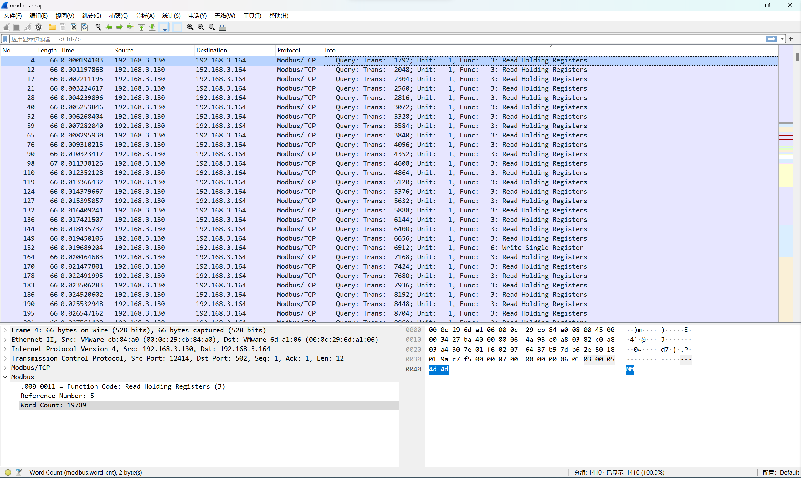

# 第十六届全国大学生信息安全竞赛——创新实践能力赛WriteUp

## Misc

### 签到卡

输错代码后，会看到官方提示：
!!! tip
    python3打印文件内容：

    ```python
    print(open('/etc/passwd').read())
    ```

可以猜测是需要通过输入代码打开什么文件，索性尝试`/flag`，输入`print(open('/flag').read())`结果如下：


获得`flag{Od2e2ea0-0896-4ee6-a925-09acee3db3a9}}`

### 国粹

!!! info "题干"

    === "题目"
        
    === "a"
        
    === "b"
        

可以看到最后两张图长度相同，对其后有一定的规律

+ 第一行每一张牌面对应的牌面没有重复的

+ 第一行相同的牌面，第二行对应的牌面按照一定的顺序排列：

  + 一万 到 九万
  
  + 一饼 到 九饼
  
  + 一条 到 九条
  
  + 东南西北风

  + 中发白

  + 春夏秋冬
  
  + 梅兰竹菊


同时题干图片中第一行第一个为空白第二行以一个为一万，可以联想到**坐标轴**，

于是尝试将`(a,k)`对应的各个点描出：


可以隐约发现`flag{}`，对图片进行翻转操作后：


最后获得`flag{202305012359}`（未验证）

### Modbus

题目为一个流量包，根据题干提示（还有高人指点），筛选`modbus`协议的流量包：


注意最后的`Word Count`，将前14个流量包对应的十六进制提取出来拼接获得`MMYWMX3GNEYW
OXZRGAYDA===`，再通过Base32解码获得`c1f_fi1g_1000`.

于是`flag{c1f_fi1g_1000}`

（本题一直摸鱼，全靠队友:joy:）